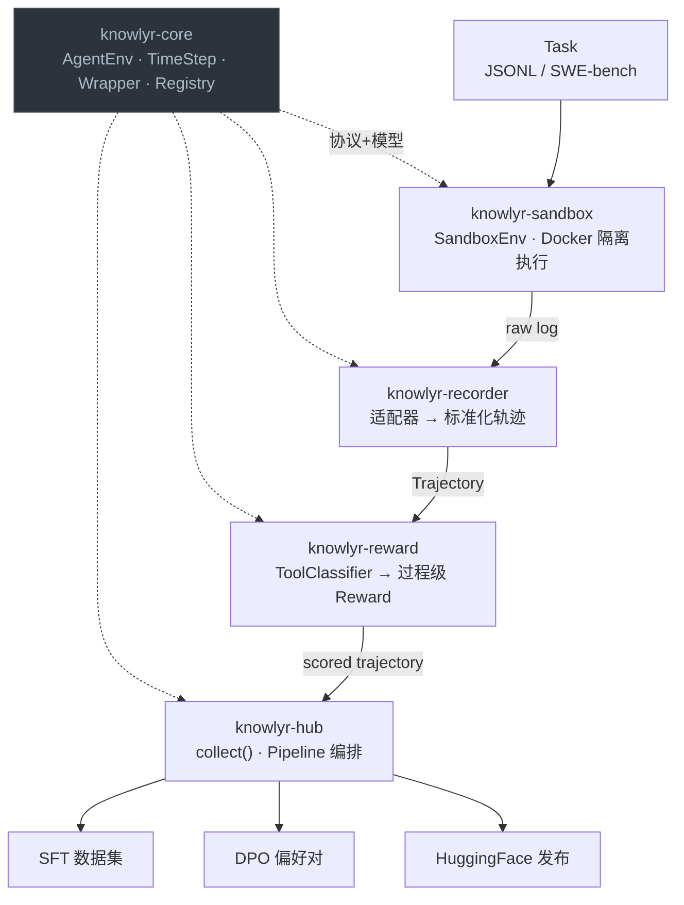
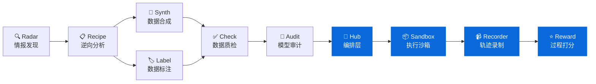

<div align="center">

<h1>🤖 knowlyr-agent</h1>

<p><strong>Agent 轨迹数据工程 Monorepo — 执行、录制、评分、编排一站式 Pipeline</strong><br/>
<em>Agent trajectory data engineering monorepo — sandbox execution, trajectory recording, process reward scoring & pipeline orchestration</em></p>

[](https://www.python.org/downloads/)
[](LICENSE)
<br/>
[](https://github.com/liuxiaotong/knowlyr-agent/actions/workflows/ci.yml)
[](#开发)
[](#mcp-server)
[](#子包一览)

[子包一览](#子包一览) · [架构](#架构) · [安装](#安装) · [快速开始](#快速开始) · [Gym-Style API](#gym-style-api) · [多领域支持](#多领域支持) · [MCP Server](#mcp-server) · [开发](#开发) · [生态](#data-pipeline-生态)

</div>

---

> 🎯 **5 包 Monorepo** core · sandbox · recorder · reward · hub，独立安装、独立 MCP
> 🏋️ **Gym-Style API** AgentEnv / TimeStep / Wrapper / Registry，兼容 Gymnasium 生态
> 🌐 **多领域支持** Coding · Browser · 自定义 DomainProfile，声明式配置切换领域
> 📦 **训练格式导出** SFT / DPO / HuggingFace 一键发布

## 子包一览

| 包名 | 功能 | CLI | MCP | 测试 |
|------|------|-----|-----|------|
| [**knowlyr-core**](packages/core/) | 共享模型 + Gym 协议 (AgentEnv, TimeStep, Wrapper, Registry) | — | — | 96 |
| [**knowlyr-sandbox**](packages/sandbox/) | Docker 沙箱执行环境 + SandboxEnv 适配器 | `knowlyr-sandbox` | 4 Tools | 65 |
| [**knowlyr-recorder**](packages/recorder/) | Agent 轨迹录制、格式转换、适配器注册表 | `knowlyr-recorder` | 3 Tools | 62 |
| [**knowlyr-reward**](packages/reward/) | 过程级 Rubric Reward (规则层 + LLM-as-Judge)，多领域 ToolClassifier | `knowlyr-reward` | 4 Tools | 131 |
| [**knowlyr-hub**](packages/hub/) | Pipeline 编排、轨迹收集 (collect)、数据集导出 (SFT/DPO/HuggingFace) | `knowlyr-hub` | 5 Tools | 73 |

每个包**独立安装、独立使用**，sandbox / recorder / reward 三者无交叉依赖。Hub 通过可选依赖串联全部包。

## 架构



## 安装

```bash
pip install knowlyr-hub[all]   # 安装全部包
```

<details>
<summary>📦 按需安装单个包</summary>

```bash
pip install knowlyr-core       # 共享模型（其他包会自动依赖）
pip install knowlyr-sandbox    # 沙箱执行
pip install knowlyr-recorder   # 轨迹录制
pip install knowlyr-reward     # Reward 评分
pip install knowlyr-hub        # Pipeline 编排

# Reward LLM-as-Judge 需要额外安装
pip install knowlyr-reward[llm]   # anthropic + openai
```

</details>

## 快速开始

### CLI

```bash
# 1. 转换 Agent 日志为标准轨迹
knowlyr-recorder convert agent_log.jsonl -f openhands -o trajectory.json

# 2. 对轨迹计算 Reward（默认 coding 领域）
knowlyr-reward score trajectory.json

# 3. 对浏览器 Agent 轨迹评分（指定领域）
knowlyr-reward score browser_traj.json --domain browser

# 4. 使用自定义 DomainProfile 评分
knowlyr-reward score traj.json --domain examples/browser_profile.json

# 5. 比较同一任务的多条轨迹
knowlyr-reward compare traj_a.json traj_b.json

# 6. Hub: 处理单个日志 → 带 Reward 的标准轨迹
knowlyr-hub process agent_log.jsonl -f openhands --save

# 7. Hub: 批量处理日志目录
knowlyr-hub process-batch ./logs/ -f sweagent -p "*.json"

# 8. 导出为训练格式
knowlyr-hub export --format sft -t output/trajectories.jsonl -o sft_data.jsonl
knowlyr-hub export --format dpo -t output/trajectories.jsonl -p output/preferences.jsonl -o dpo_data.jsonl

# 9. 发布到 HuggingFace
knowlyr-hub publish -t output/trajectories.jsonl --repo-id user/my-dataset --generate-card
```

### Python API

```python
from trajectoryhub import Pipeline, PipelineConfig, Trajectory

# 从日志生成带评分的轨迹
pipeline = Pipeline(PipelineConfig(output_dir="./output"))
traj: Trajectory = pipeline.run_from_log("agent.jsonl", "openhands")
print(f"Reward: {traj.reward:.3f}, Steps: {traj.total_steps}")

# 批量处理
trajectories = pipeline.run_batch_from_logs("./logs/", "sweagent", "*.json")

# 直接使用 Reward 引擎
from agentreward import RewardEngine
engine = RewardEngine()
result = engine.score({"task": "Fix bug", "steps": [...], "outcome": {"success": True}})
print(f"Total: {result.total_score:.3f}")

# 多领域: 用 Browser DomainProfile 评分
from knowlyrcore import load_domain_profile
from agentreward import RewardEngine

profile = load_domain_profile("browser_profile.json")
engine = RewardEngine(profile=profile)
result = engine.score(browser_trajectory_data)
```

<details>
<summary>🏋️ Gym-Style API</summary>

## Gym-Style API

借鉴 [Gymnasium](https://github.com/Farama-Foundation/Gymnasium) / [BrowserGym](https://github.com/ServiceNow/BrowserGym) / [AgentGym](https://github.com/WooooDyy/AgentGym) 设计，提供统一的环境协议和可组合 Wrapper。

### AgentEnv 协议

所有环境（Docker 沙箱、浏览器、API mock）实现相同接口：

```python
from knowlyrcore.env import AgentEnv
from knowlyrcore.timestep import TimeStep

class MyEnv(AgentEnv):
    domain = "my_domain"

    def reset(self, *, task=None, seed=None) -> TimeStep:
        return TimeStep(observation="ready")

    def step(self, action: dict) -> TimeStep:
        return TimeStep(observation="result", terminated=(action["tool"] == "submit"))

    @property
    def available_tools(self):
        return ["observe", "act", "submit"]
```

### 注册与发现

```python
from knowlyrcore.registry import register, make, list_envs

register("my-project/my-env", MyEnv, domain="my_domain")

env = make("my-project/my-env")      # 按 ID 创建实例
envs = list_envs(domain="coding")    # 按领域查询
```

### Wrapper 可组合

```python
from knowlyrcore.wrappers import MaxStepsWrapper, RewardWrapper, RecorderWrapper

env = make("knowlyr/sandbox")
env = MaxStepsWrapper(env, max_steps=50)           # 限制步数
env = RewardWrapper(env, reward_fn=my_reward_fn)   # 注入 reward
env = RecorderWrapper(env, agent_name="my-agent")  # 录制轨迹

ts = env.reset(task=my_task)
while not ts.done:
    action = agent(ts.observation)
    ts = env.step(action)

trajectory = env.get_trajectory()   # RecorderWrapper 提供
```

内置 4 个 Wrapper：`MaxStepsWrapper` (步数截断)、`TimeoutWrapper` (超时截断)、`RewardWrapper` (reward 注入)、`RecorderWrapper` (轨迹录制)。

### collect() 批量收集

```python
from trajectoryhub import collect

trajs = collect(
    "knowlyr/sandbox",       # env ID 或 AgentEnv 实例
    agent=my_agent,          # (observation) -> action dict
    n_episodes=10,
    max_steps=30,
    agent_name="my-agent",
    model_name="gpt-4o",
)
```

详见 [`examples/gym_usage.py`](examples/gym_usage.py)。

</details>

## 多领域支持

默认为 **coding** 领域（Code Agent / SWE-bench），同时支持 Browser Agent、Data Analysis 等任意 tool-use agent 领域。通过 `DomainProfile` 声明式配置，告诉每个包当前在哪个领域运行。

### 内置领域

| 领域 | Profile | 说明 | 预定义工具 |
|------|---------|------|-----------|
| `coding` | `CODING_PROFILE` | Code Agent (默认) | read_file, edit_file, bash, grep, submit... |
| `browser` | `BROWSER_PROFILE` | Browser Agent | navigate, click, type_text, screenshot, scroll... |
| `generic` | `GENERIC_PROFILE` | 通用 (无预定义工具) | 规则层退化为启发式模式 |

<details>
<summary>🔧 自定义 DomainProfile</summary>

### DomainProfile 结构

```python
from knowlyrcore import DomainProfile, ToolSpec, ToolCategory, OutcomeSpec

profile = DomainProfile(
    domain="my_domain",
    display_name="My Custom Domain",
    tools=[
        ToolSpec(name="observe", category=ToolCategory.READ, stateful_key="target"),
        ToolSpec(name="act", category=ToolCategory.WRITE, stateful_key="target"),
        ToolSpec(name="search", category=ToolCategory.SEARCH),
        ToolSpec(name="done", category=ToolCategory.SUBMIT),
    ],
    outcome_spec=OutcomeSpec(success_field="success", score_field="score"),
    default_rubric_weights={
        "goal_progress": 0.35,
        "tool_selection": 0.20,
        "param_correctness": 0.20,
        "info_utilization": 0.10,
        "non_redundancy": 0.15,
    },
)
```

工具类别 (`ToolCategory`)：`READ` / `WRITE` / `SEARCH` / `EXECUTE` / `NAVIGATE` / `SUBMIT` / `THINK`

### 自定义适配器

Recorder 提供适配器注册表，支持注册自定义 Agent 框架适配器：

```python
from agentrecorder.adapters import BaseAdapter, register_adapter

class MyAgentAdapter(BaseAdapter):
    domain = "browser"

    def parse(self, log_path: str) -> Trajectory:
        ...  # 解析你的 Agent 日志

    def validate(self, log_path: str) -> bool:
        ...  # 验证日志格式

register_adapter("my-agent", MyAgentAdapter)
```

详见 [`examples/browser_profile.json`](examples/browser_profile.json) 和 [`examples/browser_trajectory.json`](examples/browser_trajectory.json)。

</details>

## MCP Server

每个子包提供独立的 MCP Server，共 16 个 Tools：

| Server | 启动方式 |
|--------|---------|
| knowlyr-sandbox | `python -m agentsandbox.mcp_server` |
| knowlyr-recorder | `python -m agentrecorder.mcp_server` |
| knowlyr-reward | `python -m agentreward.mcp_server` |
| knowlyr-hub | `python -m trajectoryhub.mcp_server` |

<details>
<summary>16 Tools 详情</summary>

- **sandbox**: `create_sandbox`, `execute_tool`, `reset_sandbox`, `replay_trajectory`
- **recorder**: `convert_log`, `validate_log`, `get_schema`
- **reward**: `score_trajectory`, `compare_trajectories`, `build_preferences`, `list_rubrics`
- **hub**: `run_pipeline`, `export_dataset`, `process_log`, `process_logs_batch`, `pipeline_status`

</details>

## 开发

```bash
git clone https://github.com/liuxiaotong/knowlyr-agent.git
cd knowlyr-agent

make install-dev        # 开发模式安装全部包
make test               # 运行全部测试 (444 passed)
make test-sandbox       # 单独测试某个包
make test-integration   # 跨包集成测试 (17 tests)
make lint               # ruff 检查
make build              # 构建全部包
```

## Data Pipeline 生态

本项目是 [knowlyr 数据工程生态](https://github.com/liuxiaotong) 的 Agent 工具链部分：

### 生态项目

| 层 | 项目 | PyPI 包 | 说明 | 仓库 |
|---|---|---|---|---|
| 情报 | **AI Dataset Radar** | knowlyr-radar | 数据集竞争情报、趋势分析 | [GitHub](https://github.com/liuxiaotong/ai-dataset-radar) |
| 分析 | **DataRecipe** | knowlyr-datarecipe | 逆向分析、Schema 提取、成本估算 | [GitHub](https://github.com/liuxiaotong/data-recipe) |
| 生产 | **DataSynth** | knowlyr-datasynth | LLM 批量合成、种子数据扩充 | [GitHub](https://github.com/liuxiaotong/data-synth) |
| 生产 | **DataLabel** | knowlyr-datalabel | 轻量标注工具、多标注员合并 | [GitHub](https://github.com/liuxiaotong/data-label) |
| 质检 | **DataCheck** | knowlyr-datacheck | 规则验证、重复检测、分布分析 | [GitHub](https://github.com/liuxiaotong/data-check) |
| 质检 | **ModelAudit** | knowlyr-modelaudit | 蒸馏检测、模型指纹、身份验证 | [GitHub](https://github.com/liuxiaotong/model-audit) |
| Agent | **knowlyr-agent** | knowlyr-sandbox / recorder / reward / hub | 沙箱 + 轨迹录制 + Reward + 编排 | You are here |

<details>
<summary>🗺️ 生态架构图</summary>



</details>

## License

MIT

---

<div align="center">
<sub><a href="https://github.com/liuxiaotong">knowlyr</a> 数据工程生态 · Agent 轨迹数据工程</sub>
</div>
