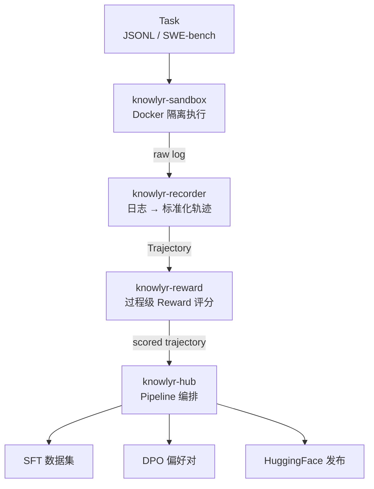

<div align="center">

# knowlyr-agent

**Agent 轨迹数据工程 Monorepo — 执行、录制、评分、编排一站式 Pipeline**
**Agent trajectory data engineering — sandbox, record, reward & orchestrate in one repo**

[](https://www.python.org/downloads/)
[](LICENSE)
[](#开发)
[](#mcp-server)
[](#子包一览)

[子包一览](#子包一览) · [架构](#架构) · [安装](#安装) · [MCP Server](#mcp-server) · [开发](#开发) · [生态](#data-pipeline-生态)

</div>

---

**GitHub Topics**: `code-agent`, `trajectory`, `process-reward`, `mcp`, `ai-data-pipeline`, `knowlyr`

Monorepo 管理 4 个独立 Python 包，覆盖 Code Agent 轨迹数据生产全链路：沙箱执行 → 轨迹录制 → Reward 评分 → Pipeline 编排与数据集导出。每个包独立安装、独立 MCP Server，也可通过 Hub 串联为完整 Pipeline。

## 架构 / Architecture



## 子包一览 / Packages

| 包名 | 功能 | CLI | MCP | 安装 |
|------|------|-----|-----|------|
| [**knowlyr-sandbox**](packages/sandbox/) | Docker 沙箱执行环境 | `knowlyr-sandbox` | 4 Tools | `pip install knowlyr-sandbox` |
| [**knowlyr-recorder**](packages/recorder/) | Agent 轨迹录制与格式转换 | `knowlyr-recorder` | 3 Tools | `pip install knowlyr-recorder` |
| [**knowlyr-reward**](packages/reward/) | 过程级 Rubric Reward 计算 | `knowlyr-reward` | 4 Tools | `pip install knowlyr-reward` |
| [**knowlyr-hub**](packages/hub/) | Pipeline 编排与数据集导出 | `knowlyr-hub` | 3 Tools | `pip install knowlyr-hub` |

每个包**独立安装、独立使用**，子包之间无交叉依赖。

## 安装 / Installation

```bash
# 按需安装单个包
pip install knowlyr-sandbox
pip install knowlyr-recorder
pip install knowlyr-reward
pip install knowlyr-hub

# 或安装 Hub 并拉取全部依赖
pip install knowlyr-hub[all]
```

## MCP Server

每个子包提供独立的 MCP Server，共 14 个 Tools：

| Server | Tools | 启动方式 |
|--------|-------|---------|
| knowlyr-sandbox | `create_sandbox`, `execute_tool`, `reset_sandbox`, `replay_trajectory` | `python -m agentsandbox.mcp_server` |
| knowlyr-recorder | `convert_log`, `validate_log`, `get_schema` | `python -m agentrecorder.mcp_server` |
| knowlyr-reward | `score_trajectory`, `compare_trajectories`, `build_preferences`, `list_rubrics` | `python -m agentreward.mcp_server` |
| knowlyr-hub | `run_pipeline`, `export_dataset`, `pipeline_status` | `python -m trajectoryhub.mcp_server` |

## 开发 / Development

```bash
git clone https://github.com/liuxiaotong/knowlyr-agent.git
cd knowlyr-agent

make install-dev    # 开发模式安装全部包
make test           # 运行全部测试 (82 passed)
make test-sandbox   # 单独测试某个包
make lint           # ruff 检查
make build          # 构建全部包
```

## Data Pipeline 生态

本项目是 [knowlyr 数据工程生态](https://github.com/liuxiaotong) 的 Agent 工具链部分：

```
情报采集 (radar) → 逆向分析 (recipe) → 数据合成 (synth) → 标注 (label)
    → 质检 (check) → 模型审计 (audit) → Agent 工具链 (agent) ← 你在这里
```

| 层 | 项目 | 说明 |
|----|------|------|
| 情报层 | [ai-dataset-radar](https://github.com/liuxiaotong/ai-dataset-radar) | AI 数据集竞争情报 |
| 分析层 | [data-recipe](https://github.com/liuxiaotong/data-recipe) | 数据集逆向分析 |
| 生产层 | [data-synth](https://github.com/liuxiaotong/data-synth) / [data-label](https://github.com/liuxiaotong/data-label) | 合成 & 标注 |
| 质检层 | [data-check](https://github.com/liuxiaotong/data-check) / [model-audit](https://github.com/liuxiaotong/model-audit) | 质检 & 审计 |
| Agent层 | **knowlyr-agent** | 执行 → 录制 → 评分 → 编排 |

## License

MIT
