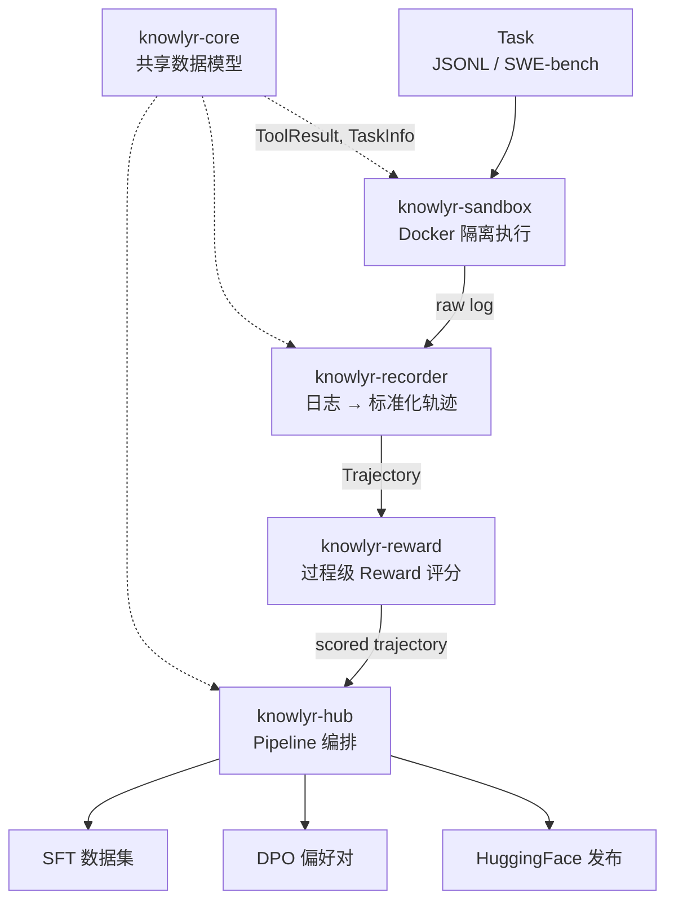
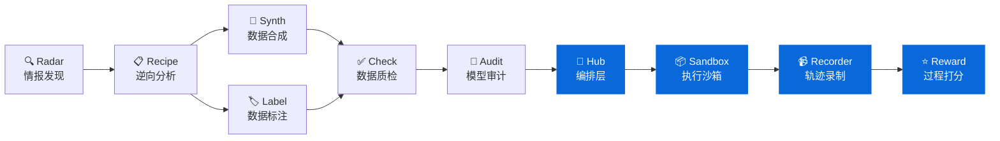

<div align="center">

# knowlyr-agent

**Agent 轨迹数据工程 Monorepo — 执行、录制、评分、编排一站式 Pipeline**
**Agent trajectory data engineering monorepo — sandbox execution, trajectory recording, process reward scoring & pipeline orchestration**

[](https://www.python.org/downloads/)
[](LICENSE)
[](#开发)
[](#mcp-server)
[](#子包一览)

[子包一览](#子包一览) · [架构](#架构) · [安装](#安装) · [MCP Server](#mcp-server) · [开发](#开发) · [生态](#data-pipeline-生态)

</div>

---

**GitHub Topics**: `code-agent`, `trajectory`, `process-reward`, `mcp`, `ai-data-pipeline`, `knowlyr`

Monorepo 管理 5 个独立 Python 包，覆盖 Code Agent 轨迹数据生产全链路：共享模型 → 沙箱执行 → 轨迹录制 → Reward 评分 → Pipeline 编排与数据集导出。每个包独立安装、独立 MCP Server，也可通过 Hub 串联为完整 Pipeline。

## 架构 / Architecture



## 子包一览 / Packages

| 包名 | 功能 | CLI | MCP |
|------|------|-----|-----|
| [**knowlyr-core**](packages/core/) | 共享数据模型 (ToolResult, TaskInfo) | — | — |
| [**knowlyr-sandbox**](packages/sandbox/) | Docker 沙箱执行环境 | `knowlyr-sandbox` | 4 Tools |
| [**knowlyr-recorder**](packages/recorder/) | Agent 轨迹录制与格式转换 (OpenHands / SWE-agent) | `knowlyr-recorder` | 3 Tools |
| [**knowlyr-reward**](packages/reward/) | 过程级 Rubric Reward 计算 (规则层 + LLM-as-Judge) | `knowlyr-reward` | 4 Tools |
| [**knowlyr-hub**](packages/hub/) | Pipeline 编排、日志处理与数据集导出 | `knowlyr-hub` | 5 Tools |

每个包**独立安装、独立使用**，sandbox/recorder/reward 三者无交叉依赖。安装：`pip install <包名>`

## 安装 / Installation

```bash
# 按需安装单个包
pip install knowlyr-core       # 共享模型（其他包会自动依赖）
pip install knowlyr-sandbox    # 沙箱执行
pip install knowlyr-recorder   # 轨迹录制
pip install knowlyr-reward     # Reward 评分
pip install knowlyr-hub        # Pipeline 编排

# 或安装 Hub 并拉取全部依赖
pip install knowlyr-hub[all]

# Reward LLM-as-Judge 需要额外安装
pip install knowlyr-reward[llm]   # anthropic + openai
```

## MCP Server

每个子包提供独立的 MCP Server，共 16 个 Tools：

| Server | 启动方式 |
|--------|---------|
| knowlyr-sandbox | `python -m agentsandbox.mcp_server` |
| knowlyr-recorder | `python -m agentrecorder.mcp_server` |
| knowlyr-reward | `python -m agentreward.mcp_server` |
| knowlyr-hub | `python -m trajectoryhub.mcp_server` |

<details>
<summary>16 Tools 详情</summary>

- **sandbox**: `create_sandbox`, `execute_tool`, `reset_sandbox`, `replay_trajectory`
- **recorder**: `convert_log`, `validate_log`, `get_schema`
- **reward**: `score_trajectory`, `compare_trajectories`, `build_preferences`, `list_rubrics`
- **hub**: `run_pipeline`, `export_dataset`, `process_log`, `process_logs_batch`, `pipeline_status`

</details>

## 快速开始 / Quick Start

```bash
# 处理单个 Agent 日志 → 带 Reward 评分的标准轨迹
knowlyr-hub process agent_log.jsonl -f openhands --save

# 批量处理日志目录
knowlyr-hub process-batch ./logs/ -f sweagent -p "*.json"

# 导出为训练格式
knowlyr-hub export --format sft -t output/trajectories.jsonl -o sft_data.jsonl
knowlyr-hub export --format dpo -t output/trajectories.jsonl -p output/preferences.jsonl -o dpo_data.jsonl

# 发布到 HuggingFace
knowlyr-hub publish -t output/trajectories.jsonl --repo-id user/my-dataset --generate-card
```

<details>
<summary>Python API</summary>

```python
from trajectoryhub import Pipeline, PipelineConfig, Trajectory

# 从日志生成带评分的轨迹
pipeline = Pipeline(PipelineConfig(output_dir="./output"))
traj: Trajectory = pipeline.run_from_log("agent.jsonl", "openhands")
print(f"Reward: {traj.reward:.3f}, Steps: {traj.total_steps}")

# 批量处理
trajectories = pipeline.run_batch_from_logs("./logs/", "sweagent", "*.json")

# Reward 评分
from agentreward import RewardEngine
engine = RewardEngine()
result = engine.score({"task": "Fix bug", "steps": [...], "outcome": {"success": True}})
print(f"Total: {result.total_score:.3f}")
```

</details>

## 开发 / Development

```bash
git clone https://github.com/liuxiaotong/knowlyr-agent.git
cd knowlyr-agent

make install-dev        # 开发模式安装全部包
make test               # 运行全部测试 (244 passed)
make test-sandbox       # 单独测试某个包
make test-integration   # 跨包集成测试 (17 tests)
make lint               # ruff 检查
make build              # 构建全部包
```

## Data Pipeline 生态

本项目是 [knowlyr 数据工程生态](https://github.com/liuxiaotong) 的 Agent 工具链部分：



### 生态项目

| 层 | 项目 | PyPI 包 | 说明 |
|---|---|---|---|
| 情报 | [**AI Dataset Radar**](https://github.com/liuxiaotong/ai-dataset-radar) | `knowlyr-radar` | 数据集竞争情报、趋势分析 |
| 分析 | [**DataRecipe**](https://github.com/liuxiaotong/data-recipe) | `knowlyr-datarecipe` | 逆向分析、Schema 提取、成本估算 |
| 生产 | [**DataSynth**](https://github.com/liuxiaotong/data-synth) | `knowlyr-datasynth` | LLM 批量合成、种子数据扩充 |
| 生产 | [**DataLabel**](https://github.com/liuxiaotong/data-label) | `knowlyr-datalabel` | 轻量标注工具、多标注员合并 |
| 质检 | [**DataCheck**](https://github.com/liuxiaotong/data-check) | `knowlyr-datacheck` | 规则验证、重复检测、分布分析 |
| 质检 | [**ModelAudit**](https://github.com/liuxiaotong/model-audit) | `knowlyr-modelaudit` | 蒸馏检测、模型指纹、身份验证 |
| Agent | **knowlyr-agent** | `knowlyr-*` | 沙箱 + 轨迹录制 + Reward + 编排 `You are here` |

## License

MIT

---

<div align="center">
<sub><a href="https://github.com/liuxiaotong">knowlyr</a> 数据工程生态 · Agent 轨迹数据工程</sub>
</div>
