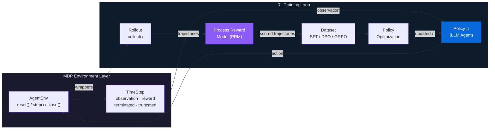
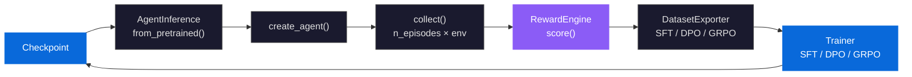
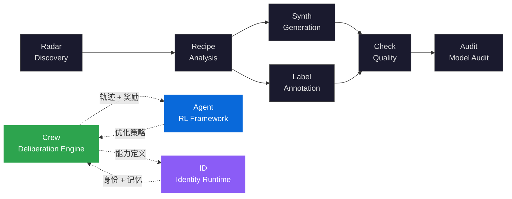

<div align="center">

<h1>knowlyr-agent</h1>

<h3>Gymnasium-Style Reinforcement Learning Framework<br/>for LLM Agent Training</h3>

<p><strong>MDP 形式化 · 三层过程奖励模型 · SFT / DPO / GRPO 策略优化</strong><br/>
<em>Formalized MDP environments, three-layer process reward, and complete policy optimization pipeline</em></p>

[](https://www.python.org/downloads/)
[](LICENSE)
[](https://github.com/liuxiaotong/knowlyr-agent/actions/workflows/ci.yml)
<br/>
[](#development)
[](#components)
[](#environments)
[](#domain-profiles)
[](#policy-optimization)
[](#agent-training-enhancements)

[Abstract](#abstract) · [Problem Statement](#problem-statement) · [MDP Formulation](#mdp-formulation) · [Architecture](#architecture) · [Key Innovations](#key-innovations) · [Components](#components) · [Quick Start](#quick-start) · [Ecosystem](#ecosystem) · [References](#references)

</div>

---

## Abstract

knowlyr-agent 将 LLM tool-use agent 任务形式化为马尔可夫决策过程 $\langle \mathcal{S}, \mathcal{A}, T, R, \gamma \rangle$，在 Gymnasium 兼容的环境协议上构建完整的强化学习训练框架。系统核心是三层过程奖励模型（规则确定性检测 → LLM-as-Judge 语义评分 → 人工校准），为每个 action 计算步骤级即时奖励 $r_t = R(s_t, a_t)$，而非仅评估最终结果。基于 scored trajectories，训练管线支持 SFT（行为克隆）、DPO（偏好对齐）、GRPO（在线策略优化）三种策略优化方法，并提供 observation masking、step-weighted loss、curriculum learning 等 6 项 Agent 长程任务增强。通过领域无关的抽象层 `DomainProfile`，框架可泛化至 coding、browser、conversation、engineering、advisory、discussion 等任意 Agent 领域。

> **knowlyr-agent** formalizes LLM tool-use agent tasks as Markov Decision Processes (MDPs) and provides a modular framework for environment interaction, process reward computation, and policy optimization. The system implements a Gymnasium-compatible environment protocol with composable wrappers, a three-layer Process Reward Model (rule-based + LLM-as-Judge + human calibration), and a complete training pipeline supporting SFT, DPO, and GRPO. Through a domain-agnostic abstraction layer (`DomainProfile`), it generalizes across coding, browser, conversation, and custom agent domains.

---

## Problem Statement

LLM Agent 训练面临三个结构性缺陷：缺少**标准化环境协议** (standardized environment protocol)、缺少**步骤级过程奖励** (step-level process reward)、缺少**领域泛化能力** (domain generalization)。现有框架普遍只关注 Agent 推理端，训练闭环依赖手工拼接，奖励信号粗糙且不可分解。

| 根本性问题 | 形式化定义 | 现有框架的局限 | Agent 的方法 |
|:---|:---|:---|:---|
| **环境协议碎片化**<br/>Fragmented Env Protocol | Agent 与环境的交互接口不统一，复用成本 $\propto$ 环境数量 | AgentGym / BrowserGym 各自定义接口，跨环境迁移需重写适配层 | Gymnasium 兼容协议：`reset()` / `step()` / `close()` + 注册表 + 可组合 Wrapper |
| **奖励信号粗糙**<br/>Sparse Outcome Reward | 仅评估最终结果 $R_T$，中间步骤无信号 $\forall t < T: r_t = 0$ | SWE-bench 只看 patch 是否通过测试，无法区分"方向正确但未完成"与"完全跑偏" | 三层 PRM：规则层（$\sim$0 成本）→ LLM-as-Judge → 人工校准，步骤级 $r_t = R(s_t, a_t)$ |
| **领域锁定**<br/>Domain Lock-in | 环境定义与特定领域强耦合，新领域需从零构建 | 多数框架仅支持 coding / browser，扩展新领域需改核心代码 | `DomainProfile` 声明式领域抽象：工具集、类别映射、评分维度权重，7 内置 + 自定义 |

> knowlyr-agent 不是又一个 Agent 推理框架。它是 LLM Agent 的**训练基础设施**——"在哪练、怎么评、如何优化"，环境产出轨迹，奖励评估质量，训练器优化策略，三者通过标准化数据格式串联为闭环。

---

## MDP Formulation

将 tool-use agent 任务建模为 MDP $\langle \mathcal{S}, \mathcal{A}, T, R, \gamma \rangle$：

| Symbol | Definition | Implementation |
|--------|-----------|----------------|
| $\mathcal{S}$ | State space (text observations) | `TimeStep.observation: str` |
| $\mathcal{A}$ | Action space (tool calls) | `{"tool": str, "params": dict}` |
| $T(s'\|s,a)$ | Transition dynamics | `AgentEnv.step(action) → TimeStep` |
| $R(s,a)$ | Reward function | `RewardEngine` — three-layer PRM |
| $\pi(a\|s)$ | Policy | LLM agent: `observation → action` |
| $\gamma$ | Horizon | `MaxStepsWrapper` (implicit truncation) |

**Environment protocol** 借鉴 Gymnasium (Towers et al., 2024)，并针对 LLM Agent 场景做出适配：动作空间为结构化 tool call（而非连续/离散向量），状态空间为自然语言文本，终止条件由 `terminated` (任务完成) 和 `truncated` (步数/超时截断) 双信号控制。

---

## Architecture

以 RL 训练循环为核心：策略（LLM）在环境中交互产生轨迹，经过程奖励模型评分后，构造训练数据集用于策略优化，优化后的策略再次进入环境采样。



### Layered Architecture

| 层 | 模块 | 职责 |
|:---|:---|:---|
| **MDP Protocol** | AgentEnv · TimeStep · EnvWrapper · Registry | Gymnasium 兼容环境协议，注册表发现，可组合 Wrapper |
| **Domain** | DomainProfile · 7 内置领域 | 声明式领域抽象：工具集、类别映射、评分维度权重 |
| **Environment** | SandboxEnv · ConversationEnv · Docker 沙箱 | 5 个注册环境，coding / conversation / engineering / advisory / discussion |
| **Trajectory** | AgentRecorder · 适配器注册表 | Agent 日志解析，多格式适配（OpenHands / SWE-agent / 自定义），标准化轨迹 |
| **Reward** | RewardEngine · Rubric · PreferenceBuilder | 三层 PRM + 多维度 Rubric 评分 + 偏好对构建 |
| **Data** | collect() · DatasetExporter · Pipeline · CAS · GDI | Rollout 采样，SFT / DPO / GRPO 格式导出，CAS 内容寻址去重，GDI 质量排名，端到端管线编排 |
| **Training** | SFTTrainer · DPOTrainer · GRPOTrainer | 三种策略优化 + 6 项 Agent 增强 + 评估与统计检验 |
| **Inference** | AgentInference · Checkpoint | 推理桥：checkpoint 加载 → create_agent() → collect → train 闭环 |

---

## Key Innovations

### 1. Gymnasium-Compatible Environment Protocol

LLM Agent 环境缺乏统一接口——每个框架自行定义交互协议，环境复用成本高、Wrapper 不可组合。knowlyr-agent 实现完整的 Gymnasium 兼容协议，将 `reset()` / `step()` / `close()` 三方法模式扩展至 LLM 场景：

**5 个注册环境**：

| env_id | Class | Domain | Terminal Condition |
|--------|-------|--------|-------------------|
| `knowlyr/sandbox` | `SandboxEnv` | coding | `submit` / `finish` |
| `knowlyr/conversation` | `ConversationEnv` | conversation | `respond` |
| `knowlyr/engineering` | `ConversationEnv` | engineering | `submit` / `finish` |
| `knowlyr/advisory` | `ConversationEnv` | advisory | `submit` / `finish` |
| `knowlyr/discussion` | `ConversationEnv` | discussion | `respond` / `submit` |

**4 个可组合 Wrapper**：

```python
from knowlyrcore.wrappers import MaxStepsWrapper, TimeoutWrapper, RewardWrapper, RecorderWrapper

env = make("knowlyr/sandbox")
env = MaxStepsWrapper(env, max_steps=50)           # horizon truncation
env = RewardWrapper(env, reward_fn=my_reward_fn)   # step-level reward injection
env = RecorderWrapper(env, agent_name="my-agent")  # trajectory recording

ts = env.reset(task=my_task)
while not ts.done:
    action = agent(ts.observation)
    ts = env.step(action)

trajectory = env.get_trajectory()
```

**自定义环境**：

```python
from knowlyrcore import AgentEnv, TimeStep, register, make

class MyEnv(AgentEnv):
    domain = "my_domain"

    def reset(self, *, task=None, seed=None) -> TimeStep:
        return TimeStep(observation="ready")

    def step(self, action: dict) -> TimeStep:
        return TimeStep(observation="result", terminated=(action["tool"] == "submit"))

    @property
    def available_tools(self):
        return ["observe", "act", "submit"]

register("my-project/my-env", MyEnv, domain="my_domain")
env = make("my-project/my-env")
```

### 2. DomainProfile — Domain-Agnostic Abstraction

`DomainProfile` 声明式配置环境领域特征——工具集、工具类别、结果判定规则、评分维度权重。新增领域无需修改核心代码，只需定义一份 Profile：

| Domain | Typical Tools | Application |
|--------|--------------|-------------|
| **coding** | `read_file`, `edit_file`, `bash`, `grep`, `submit` | Code Agent (SWE-bench style) |
| **browser** | `navigate`, `click`, `type_text`, `scroll`, `screenshot` | Web automation |
| **conversation** | `respond`, `query_stats`, `send_message`, `web_search` | Dialog agent |
| **engineering** | `read_file`, `grep`, `git`, `knowledge_base`, `bash` | Code review, architecture |
| **advisory** | `respond`, `knowledge_base`, `web_search`, `create_note` | Expert consultation |
| **discussion** | `respond`, `knowledge_base`, `think` | Multi-turn discussion |
| **generic** | (empty — heuristic fallback) | Custom domains |

### 3. Three-Layer Process Reward Model

与仅评估最终结果的 Outcome Reward Model (ORM) 不同，本系统实现步骤级 Process Reward Model (PRM)，为每个 action 计算即时奖励 $r_t = R(s_t, a_t)$，三层架构逐层提升评估质量：

```
Layer 1: Rule-based (deterministic)     Layer 2: LLM-as-Judge         Layer 3: Human
┌─────────────────────────────────┐    ┌──────────────────────────┐   ┌──────────────┐
│ Redundancy detection            │    │ Rubric-based scoring     │   │ Calibration  │
│ Regression detection            │ →  │ Multi-dimensional eval   │ → │ via human    │
│ Information utilization         │    │ Semantic quality judge   │   │ annotations  │
│ Efficiency analysis             │    │ (OpenAI / Anthropic API) │   │              │
└─────────────────────────────────┘    └──────────────────────────┘   └──────────────┘
  Cost: ~0        Latency: <1ms          Cost: ~$0.01/step              Offline
```

**Rubric 评分维度**（可按 DomainProfile 自定义权重）：

| Rubric | Evaluator | Description |
|--------|-----------|-------------|
| `goal_progress` | model | 每步是否推进了任务目标 |
| `tool_selection` | model | 工具选择是否合理 |
| `param_correctness` | model | 参数是否正确 |
| `info_utilization` | rule | 是否利用了之前步骤的信息 |
| `non_redundancy` | rule | 是否避免了重复操作 |

### 4. Policy Optimization — SFT / DPO / GRPO

三种策略优化方法覆盖从行为克隆到在线策略优化的完整谱系：

| Method | Algorithm | Data Format | Use Case |
|--------|-----------|-------------|----------|
| **SFT** | Cross-entropy | instruction → response | Behavioral cloning from expert trajectories |
| **DPO** | Rafailov et al., 2023 | (chosen, rejected) pairs | Preference alignment without reward model |
| **GRPO** | DeepSeek-R1, 2024 | grouped trajectories | Online policy optimization with group advantage |

### 5. Agent Training Enhancements

6 项针对 LLM Agent 长程任务的训练增强——标准 SFT/DPO/GRPO 未考虑 Agent 场景的特殊性（多轮交互、环境输出不可学习、步骤重要性不均等），这些增强弥补了这一空白：

| Enhancement | Config | Description |
|-------------|--------|-------------|
| Multi-turn format | `agent_format=True` | 轨迹转为 assistant(thought+action) / user(observation) 多轮对话 |
| Observation masking | `mask_observations=True` | 环境 observation token 的 labels=-100，只学习决策，不学环境动力学 |
| Step-weighted loss | `step_weighted_loss=True` | 用步骤级 process reward 加权每 token 的 CE loss |
| Trajectory chunking | `chunk_long_trajectories=True` | 超长轨迹按步骤边界拆分，保留重叠上下文 |
| Curriculum learning | `curriculum=True` | 从短/高reward 轨迹到长/低reward 轨迹渐进训练 |
| Step-level GRPO | `step_level_advantage=True` | 轨迹级 advantage 乘以步骤 reward 加权 |

### 6. Online Training Loop & Evaluation

推理桥 (`AgentInference`) 实现 collect → train → collect 闭环，支持在线迭代训练：



**评估与统计检验**：`evaluate_agent()` 和 `compare_agents()` 提供 Agent 级别评估，内置统计检验（无 scipy 依赖）：

- **Welch's t-test** / **Mann-Whitney U** — 独立样本对比
- **Paired t-test** — 同任务配对对比
- **Bootstrap CI** — 非参数置信区间
- **Bonferroni correction** — 多重比较校正
- **Leaderboard** — 按 avg_reward 排序 + 显著性标注

---

## Components

6 个独立 PyPI 包，对应 RL 系统各组件：

| Package | RL Role | Description | Tests |
|---------|---------|-------------|-------|
| [**knowlyr-core**](packages/core/) | MDP Protocol | `AgentEnv` · `TimeStep` · `EnvWrapper` · `Registry` · `DomainProfile` | 108 |
| [**knowlyr-sandbox**](packages/sandbox/) | Environment | Docker 沙箱执行 · `SandboxEnv` · `ConversationEnv` | 101 |
| [**knowlyr-recorder**](packages/recorder/) | Trajectory Buffer | Agent 日志解析 · 标准化轨迹 · 适配器注册表 | 62 |
| [**knowlyr-reward**](packages/reward/) | Reward Model | 三层 PRM · Rubric 评分 · 偏好对构建 | 136 |
| [**knowlyr-hub**](packages/hub/) | Rollout & Data | `collect()` 采样 · `DatasetExporter` · Pipeline 编排 · CAS 去重 · GDI 排名 | 158 |
| [**knowlyr-trainer**](packages/trainer/) | Policy Optimization | SFT · DPO · GRPO · 评估 · 推理桥 | 206 |

各包独立安装、独立使用，无交叉依赖。Hub 通过可选依赖串联数据管线，Trainer 消费 Hub 导出的 JSONL。

---

## Quick Start

### Environment Interaction

```python
from knowlyrcore import make

env = make("knowlyr/conversation")
ts = env.reset(task="帮用户查询订单状态")
while not ts.done:
    action = my_agent(ts.observation)   # π(a|s)
    ts = env.step(action)              # s', r, done
env.close()
```

### Trajectory Collection with Reward

```python
from trajectoryhub import collect, make_reward_fn

reward_fn = make_reward_fn(domain="coding")  # 规则层 PRM
trajectories = collect(
    "knowlyr/sandbox",
    agent=my_agent,
    n_episodes=20,
    max_steps=30,
    reward_fn=reward_fn,
)
```

### End-to-End Training Loop

```python
from agenttrainer import SFTConfig, AgentInference
from trajectoryhub import collect, make_reward_fn, DatasetExporter

# 1. Collect trajectories
trajectories = collect("knowlyr/conversation", agent=my_agent, n_episodes=100)

# 2. Export to training format
exporter = DatasetExporter(trajectories_dir="./trajectories.jsonl")
exporter.export_sft("./sft_train.jsonl")

# 3. Train policy
# knowlyr-trainer sft --train-file sft_train.jsonl --model Qwen/Qwen2.5-Coder-7B

# 4. Load updated policy → next iteration
inference = AgentInference.from_pretrained("./checkpoints/step-1000")
updated_agent = inference.create_agent(system_prompt="你是代码助手")
new_trajectories = collect("knowlyr/sandbox", agent=updated_agent, n_episodes=50)
```

### CLI

```bash
# Trajectory recording & reward scoring
knowlyr-recorder convert agent_log.jsonl -f openhands -o trajectory.json
knowlyr-reward score trajectory.json --domain coding

# Dataset export
knowlyr-hub export --format sft -t trajectories.jsonl -o sft_data.jsonl
knowlyr-hub export --format dpo -t trajectories.jsonl -p preferences.jsonl -o dpo_data.jsonl

# Policy optimization
knowlyr-trainer sft --train-file sft_data.jsonl --model Qwen/Qwen2.5-Coder-7B
knowlyr-trainer dpo --train-file dpo_data.jsonl --model ./output/sft/final --beta 0.1
knowlyr-trainer grpo --train-file grpo_data.jsonl --model ./output/sft/final
```

---

## Installation

```bash
pip install knowlyr-hub[all]   # 全部包
```

<details>
<summary>按需安装</summary>

```bash
pip install knowlyr-core       # MDP protocol
pip install knowlyr-sandbox    # Environment
pip install knowlyr-recorder   # Trajectory buffer
pip install knowlyr-reward     # Reward model
pip install knowlyr-hub        # Rollout & data
pip install knowlyr-trainer    # Policy optimization

# Optional
pip install knowlyr-reward[llm]      # LLM-as-Judge (Anthropic + OpenAI)
pip install knowlyr-trainer[peft]    # LoRA fine-tuning
pip install knowlyr-trainer[wandb]   # Weights & Biases logging
```

</details>

---

## Development

```bash
git clone https://github.com/liuxiaotong/knowlyr-agent.git
cd knowlyr-agent

make install-dev        # 开发模式安装全部包
make test               # 运行全部测试 (771 passed)
make test-integration   # 跨包集成测试 (17 tests)
make lint               # ruff check
```

---

## Ecosystem

<details>
<summary>Architecture Diagram</summary>



</details>

| Layer | Project | Description | Repo |
|:---|:---|:---|:---|
| Discovery | **AI Dataset Radar** | 数据集竞争情报、趋势分析 | [GitHub](https://github.com/liuxiaotong/ai-dataset-radar) |
| Analysis | **DataRecipe** | 逆向分析、Schema 提取、成本估算 | [GitHub](https://github.com/liuxiaotong/data-recipe) |
| Production | **DataSynth** / **DataLabel** | LLM 批量合成 / 轻量标注 | [GitHub](https://github.com/liuxiaotong/data-synth) · [GitHub](https://github.com/liuxiaotong/data-label) |
| Quality | **DataCheck** | 规则验证、重复检测、分布分析 | [GitHub](https://github.com/liuxiaotong/data-check) |
| Audit | **ModelAudit** | 蒸馏检测、模型指纹 | [GitHub](https://github.com/liuxiaotong/model-audit) |
| Deliberation | **Crew** | 对抗式多智能体协商 · 持久记忆进化 · MCP 原生 | [GitHub](https://github.com/liuxiaotong/knowlyr-crew) |
| Identity | **knowlyr-id** | 身份系统 + AI 员工运行时 | [GitHub](https://github.com/liuxiaotong/knowlyr-id) |
| Agent Training | **knowlyr-agent** | Gymnasium 风格 RL 框架 · 过程奖励模型 · SFT/DPO/GRPO | You are here |

---

## References

- **Gymnasium** — Towers et al., 2024. *Gymnasium: A Standard Interface for Reinforcement Learning Environments.* [arXiv:2407.17032](https://arxiv.org/abs/2407.17032)
- **BrowserGym** — Drouin et al., 2024. *WorkArena: How Capable Are Web Agents at Solving Common Knowledge Work Tasks?* [arXiv:2403.07718](https://arxiv.org/abs/2403.07718)
- **AgentGym** — Xi et al., 2024. *AgentGym: Evolving Large Language Model-based Agents across Diverse Environments.* [arXiv:2406.04151](https://arxiv.org/abs/2406.04151)
- **SWE-bench** — Jimenez et al., 2024. *SWE-bench: Can Language Models Resolve Real-World GitHub Issues?* [arXiv:2310.06770](https://arxiv.org/abs/2310.06770)
- **Process Reward Models** — Lightman et al., 2023. *Let's Verify Step by Step.* [arXiv:2305.20050](https://arxiv.org/abs/2305.20050)
- **DPO** — Rafailov et al., 2023. *Direct Preference Optimization: Your Language Model is Secretly a Reward Model.* [arXiv:2305.18290](https://arxiv.org/abs/2305.18290)
- **GRPO** — Shao et al., 2024. *DeepSeekMath: Pushing the Limits of Mathematical Reasoning in Open Language Models.* [arXiv:2402.03300](https://arxiv.org/abs/2402.03300)
- **LLM-as-Judge** — Zheng et al., 2023. *Judging LLM-as-a-Judge with MT-Bench and Chatbot Arena.* [arXiv:2306.05685](https://arxiv.org/abs/2306.05685)

---

## License

[MIT](LICENSE)

---

<div align="center">
<sub><a href="https://github.com/liuxiaotong">knowlyr</a> — gymnasium-style RL framework for LLM agent training</sub>
</div>
