<div align="center">

# knowlyr-agent

**Agent 轨迹数据工程 Monorepo — 执行、录制、评分、编排一站式 Pipeline**
**Agent trajectory data engineering monorepo — sandbox execution, trajectory recording, process reward scoring & pipeline orchestration**

[](https://www.python.org/downloads/)
[](LICENSE)
[](#开发)
[](#mcp-server)
[](#子包一览)

[子包一览](#子包一览) · [架构](#架构) · [安装](#安装) · [MCP Server](#mcp-server) · [开发](#开发) · [生态](#data-pipeline-生态)

</div>

---

**GitHub Topics**: `code-agent`, `trajectory`, `process-reward`, `mcp`, `ai-data-pipeline`, `knowlyr`

Monorepo 管理 4 个独立 Python 包，覆盖 Code Agent 轨迹数据生产全链路：沙箱执行 → 轨迹录制 → Reward 评分 → Pipeline 编排与数据集导出。每个包独立安装、独立 MCP Server，也可通过 Hub 串联为完整 Pipeline。

## 架构 / Architecture

```mermaid
graph TD
    T["Task<br/>JSONL / SWE-bench"] --> S["knowlyr-sandbox<br/>Docker 隔离执行"]
    S -->|raw log| R["knowlyr-recorder<br/>日志 → 标准化轨迹"]
    R -->|Trajectory| W["knowlyr-reward<br/>过程级 Reward 评分"]
    W -->|scored trajectory| H["knowlyr-hub<br/>Pipeline 编排"]
    H --> O1["SFT 数据集"]
    H --> O2["DPO 偏好对"]
    H --> O3["HuggingFace 发布"]
```



## 子包一览 / Packages

| 包名 | 功能 | CLI | MCP | 安装 |
|------|------|-----|-----|------|
| [**knowlyr-sandbox**](packages/sandbox/) | Docker 沙箱执行环境 | `knowlyr-sandbox` | 4 Tools | `pip install knowlyr-sandbox` |
| [**knowlyr-recorder**](packages/recorder/) | Agent 轨迹录制与格式转换 | `knowlyr-recorder` | 3 Tools | `pip install knowlyr-recorder` |
| [**knowlyr-reward**](packages/reward/) | 过程级 Rubric Reward 计算 | `knowlyr-reward` | 4 Tools | `pip install knowlyr-reward` |
| [**knowlyr-hub**](packages/hub/) | Pipeline 编排与数据集导出 | `knowlyr-hub` | 3 Tools | `pip install knowlyr-hub` |

每个包**独立安装、独立使用**，子包之间无交叉依赖。

## 安装 / Installation

```bash
# 按需安装单个包
pip install knowlyr-sandbox
pip install knowlyr-recorder
pip install knowlyr-reward
pip install knowlyr-hub

# 或安装 Hub 并拉取全部依赖
pip install knowlyr-hub[all]
```

## MCP Server

每个子包提供独立的 MCP Server，共 14 个 Tools：

| Server | Tools | 启动方式 |
|--------|-------|---------|
| knowlyr-sandbox | `create_sandbox`, `execute_tool`, `reset_sandbox`, `replay_trajectory` | `python -m agentsandbox.mcp_server` |
| knowlyr-recorder | `convert_log`, `validate_log`, `get_schema` | `python -m agentrecorder.mcp_server` |
| knowlyr-reward | `score_trajectory`, `compare_trajectories`, `build_preferences`, `list_rubrics` | `python -m agentreward.mcp_server` |
| knowlyr-hub | `run_pipeline`, `export_dataset`, `pipeline_status` | `python -m trajectoryhub.mcp_server` |

## 开发 / Development

```bash
git clone https://github.com/liuxiaotong/knowlyr-agent.git
cd knowlyr-agent

make install-dev    # 开发模式安装全部包
make test           # 运行全部测试 (82 passed)
make test-sandbox   # 单独测试某个包
make lint           # ruff 检查
make build          # 构建全部包
```

## Data Pipeline 生态

本项目是 [knowlyr 数据工程生态](https://github.com/liuxiaotong) 的 Agent 工具链部分：



### 生态项目

| 层 | 项目 | PyPI 包 | 说明 | 仓库 |
|---|---|---|---|---|
| 情报 | **AI Dataset Radar** | knowlyr-radar | 数据集竞争情报、趋势分析 | [GitHub](https://github.com/liuxiaotong/ai-dataset-radar) |
| 分析 | **DataRecipe** | knowlyr-datarecipe | 逆向分析、Schema 提取、成本估算 | [GitHub](https://github.com/liuxiaotong/data-recipe) |
| 生产 | **DataSynth** | knowlyr-datasynth | LLM 批量合成、种子数据扩充 | [GitHub](https://github.com/liuxiaotong/data-synth) |
| 生产 | **DataLabel** | knowlyr-datalabel | 轻量标注工具、多标注员合并 | [GitHub](https://github.com/liuxiaotong/data-label) |
| 质检 | **DataCheck** | knowlyr-datacheck | 规则验证、重复检测、分布分析 | [GitHub](https://github.com/liuxiaotong/data-check) |
| 质检 | **ModelAudit** | knowlyr-modelaudit | 蒸馏检测、模型指纹、身份验证 | [GitHub](https://github.com/liuxiaotong/model-audit) |
| Agent | **knowlyr-agent** | knowlyr-sandbox / recorder / reward / hub | 沙箱 + 轨迹录制 + Reward + 编排 | You are here |

```mermaid
graph LR
    Radar["🔍 Radar<br/>情报发现"] --> Recipe["📋 Recipe<br/>逆向分析"]
    Recipe --> Synth["🔄 Synth<br/>数据合成"]
    Recipe --> Label["🏷️ Label<br/>数据标注"]
    Synth --> Check["✅ Check<br/>数据质检"]
    Label --> Check
    Check --> Audit["🔬 Audit<br/>模型审计"]
    Audit --> Hub["🎯 Hub<br/>编排层"]
    Hub --> Sandbox["📦 Sandbox<br/>执行沙箱"]
    Sandbox --> Recorder["📹 Recorder<br/>轨迹录制"]
    Recorder --> Reward["⭐ Reward<br/>过程打分"]
    style Hub fill:#0969da,color:#fff,stroke:#0969da
    style Sandbox fill:#0969da,color:#fff,stroke:#0969da
    style Recorder fill:#0969da,color:#fff,stroke:#0969da
    style Reward fill:#0969da,color:#fff,stroke:#0969da
```

## License

MIT

---

<div align="center">
<sub><a href="https://github.com/liuxiaotong">knowlyr</a> 数据工程生态 · Agent 轨迹数据工程</sub>
</div>
