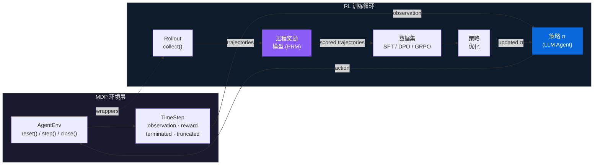
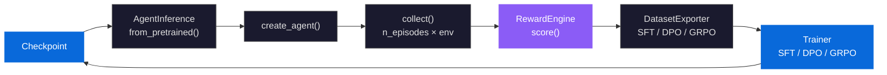
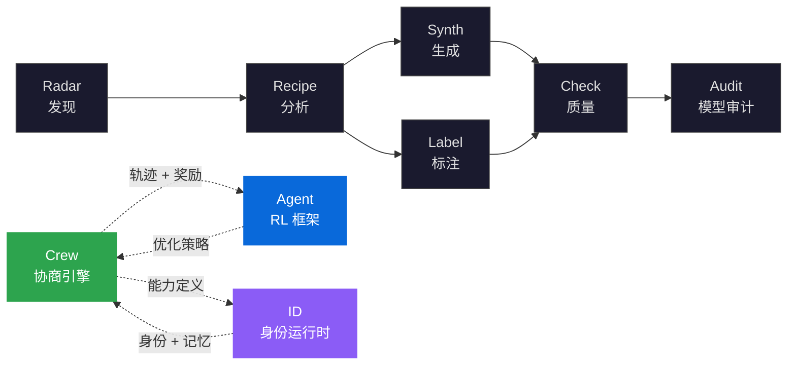

<div align="right">

[English](README.md) | **中文**

</div>

<div align="center">

<h1>knowlyr-gym</h1>

<h3>Gymnasium 风格强化学习框架<br/>Gymnasium-Style Reinforcement Learning Framework<br/>面向 LLM Agent 训练</h3>

<p><strong>MDP 形式化 · 三层过程奖励模型 · SFT / DPO / GRPO 策略优化</strong><br/>
<em>Formalized MDP environments, three-layer process reward, and complete policy optimization pipeline</em></p>

[](https://www.python.org/downloads/)
[](LICENSE)
[](https://github.com/liuxiaotong/knowlyr-gym/actions/workflows/ci.yml)
<br/>
[](#开发)
[](#组件)
[](#环境)
[](#领域配置)
[](#策略优化)
[](#agent-训练增强)

[摘要](#摘要) · [问题陈述](#问题陈述) · [MDP 形式化](#mdp-形式化) · [架构](#架构) · [核心创新](#核心创新) · [组件](#组件) · [快速开始](#快速开始) · [生态系统](#生态系统) · [参考文献](#参考文献)

</div>

---

## 摘要 / Abstract

knowlyr-gym 将 LLM tool-use agent 任务形式化为马尔可夫决策过程 $\langle \mathcal{S}, \mathcal{A}, T, R, \gamma \rangle$，在 Gymnasium 兼容的环境协议上构建完整的强化学习训练框架。系统核心是三层过程奖励模型（规则确定性检测 → LLM-as-Judge 语义评分 → 人工校准），为每个 action 计算步骤级即时奖励 $r_t = R(s_t, a_t)$，而非仅评估最终结果。基于 scored trajectories，训练管线支持 SFT（行为克隆）、DPO（偏好对齐）、GRPO（在线策略优化）三种策略优化方法，并提供 observation masking、step-weighted loss、curriculum learning 等 6 项 Agent 长程任务增强。通过领域无关的抽象层 `DomainProfile`，框架可泛化至 coding、browser、conversation、engineering、advisory、discussion 等任意 Agent 领域。

> **knowlyr-gym** 将 LLM tool-use agent 任务形式化为马尔可夫决策过程 (MDP)，提供环境交互、过程奖励计算和策略优化的模块化框架。系统实现了 Gymnasium 兼容的环境协议（支持可组合 Wrapper）、三层过程奖励模型（规则层 + LLM-as-Judge + 人工校准）以及完整的训练管线（SFT、DPO、GRPO）。通过领域无关的抽象层 (`DomainProfile`)，可泛化至 coding、browser、conversation 以及自定义 Agent 领域。

---

## 问题陈述 / Problem Statement

LLM Agent 训练面临三个结构性缺陷：缺少**标准化环境协议**、缺少**步骤级过程奖励**、缺少**领域泛化能力**。现有框架普遍只关注 Agent 推理端，训练闭环依赖手工拼接，奖励信号粗糙且不可分解。

| 根本性问题 | 形式化定义 | 现有框架的局限 | 本框架的方法 |
|:---|:---|:---|:---|
| **环境协议碎片化** | Agent 与环境的交互接口不统一，复用成本 $\propto$ 环境数量 | AgentGym / BrowserGym 各自定义接口，跨环境迁移需重写适配层 | Gymnasium 兼容协议：`reset()` / `step()` / `close()` + 注册表 + 可组合 Wrapper |
| **奖励信号粗糙** | 仅评估最终结果 $R_T$，中间步骤无信号 $\forall t < T: r_t = 0$ | SWE-bench 只看 patch 是否通过测试，无法区分"方向正确但未完成"与"完全跑偏" | 三层 PRM：规则层（$\sim$0 成本）→ LLM-as-Judge → 人工校准，步骤级 $r_t = R(s_t, a_t)$ |
| **领域锁定** | 环境定义与特定领域强耦合，新领域需从零构建 | 多数框架仅支持 coding / browser，扩展新领域需改核心代码 | `DomainProfile` 声明式领域抽象：工具集、类别映射、评分维度权重，7 内置 + 自定义 |

> knowlyr-gym 不是又一个 Agent 推理框架。它是 LLM Agent 的**训练基础设施**——"在哪练、怎么评、如何优化"，环境产出轨迹，奖励评估质量，训练器优化策略，三者通过标准化数据格式串联为闭环。

---

## MDP 形式化 / MDP Formulation

将 tool-use agent 任务建模为 MDP $\langle \mathcal{S}, \mathcal{A}, T, R, \gamma \rangle$：

| 符号 | 定义 | 实现 |
|--------|-----------|----------------|
| $\mathcal{S}$ | 状态空间（文本观测） | `TimeStep.observation: str` |
| $\mathcal{A}$ | 动作空间（工具调用） | `{"tool": str, "params": dict}` |
| $T(s'\|s,a)$ | 状态转移动力学 | `AgentEnv.step(action) → TimeStep` |
| $R(s,a)$ | 奖励函数 | `RewardEngine` — 三层 PRM |
| $\pi(a\|s)$ | 策略 | LLM agent：`observation → action` |
| $\gamma$ | 折扣因子/视野 | `MaxStepsWrapper`（隐式截断） |

**环境协议**借鉴 Gymnasium (Towers et al., 2024)，并针对 LLM Agent 场景做出适配：动作空间为结构化 tool call（而非连续/离散向量），状态空间为自然语言文本，终止条件由 `terminated`（任务完成）和 `truncated`（步数/超时截断）双信号控制。

---

## 架构 / Architecture

以 RL 训练循环为核心：策略（LLM）在环境中交互产生轨迹，经过程奖励模型评分后，构造训练数据集用于策略优化，优化后的策略再次进入环境采样。



### 分层架构 / Layered Architecture

| 层 | 模块 | 职责 |
|:---|:---|:---|
| **MDP 协议** | AgentEnv · TimeStep · EnvWrapper · Registry | Gymnasium 兼容环境协议，注册表发现，可组合 Wrapper |
| **领域** | DomainProfile · 7 内置领域 | 声明式领域抽象：工具集、类别映射、评分维度权重 |
| **环境** | SandboxEnv · ConversationEnv · Docker 沙箱 | 5 个注册环境，coding / conversation / engineering / advisory / discussion |
| **轨迹** | AgentRecorder · 适配器注册表 | Agent 日志解析，多格式适配（OpenHands / SWE-agent / 自定义），标准化轨迹 |
| **奖励** | RewardEngine · Rubric · PreferenceBuilder | 三层 PRM + 多维度 Rubric 评分 + 偏好对构建 |
| **数据** | collect() · DatasetExporter · Pipeline · CAS · GDI | Rollout 采样，SFT / DPO / GRPO 格式导出，CAS 内容寻址去重，GDI 质量排名，端到端管线编排 |
| **训练** | SFTTrainer · DPOTrainer · GRPOTrainer | 三种策略优化 + 6 项 Agent 增强 + 评估与统计检验 |
| **推理** | AgentInference · Checkpoint | 推理桥：checkpoint 加载 → create_agent() → collect → train 闭环 |

---

## 核心创新 / Key Innovations

### 1. Gymnasium 兼容环境协议 / Gymnasium-Compatible Environment Protocol

LLM Agent 环境缺乏统一接口——每个框架自行定义交互协议，环境复用成本高、Wrapper 不可组合。knowlyr-gym 实现完整的 Gymnasium 兼容协议，将 `reset()` / `step()` / `close()` 三方法模式扩展至 LLM 场景：

**5 个注册环境**：

| env_id | 类 | 领域 | 终止条件 |
|--------|-------|--------|-------------------|
| `knowlyr/sandbox` | `SandboxEnv` | coding | `submit` / `finish` |
| `knowlyr/conversation` | `ConversationEnv` | conversation | `respond` |
| `knowlyr/engineering` | `ConversationEnv` | engineering | `submit` / `finish` |
| `knowlyr/advisory` | `ConversationEnv` | advisory | `submit` / `finish` |
| `knowlyr/discussion` | `ConversationEnv` | discussion | `respond` / `submit` |

**4 个可组合 Wrapper**：

```python
from knowlyrcore.wrappers import MaxStepsWrapper, TimeoutWrapper, RewardWrapper, RecorderWrapper

env = make("knowlyr/sandbox")
env = MaxStepsWrapper(env, max_steps=50)           # 视野截断
env = RewardWrapper(env, reward_fn=my_reward_fn)   # 步骤级奖励注入
env = RecorderWrapper(env, agent_name="my-agent")  # 轨迹记录

ts = env.reset(task=my_task)
while not ts.done:
    action = agent(ts.observation)
    ts = env.step(action)

trajectory = env.get_trajectory()
```

**自定义环境**：

```python
from knowlyrcore import AgentEnv, TimeStep, register, make

class MyEnv(AgentEnv):
    domain = "my_domain"

    def reset(self, *, task=None, seed=None) -> TimeStep:
        return TimeStep(observation="ready")

    def step(self, action: dict) -> TimeStep:
        return TimeStep(observation="result", terminated=(action["tool"] == "submit"))

    @property
    def available_tools(self):
        return ["observe", "act", "submit"]

register("my-project/my-env", MyEnv, domain="my_domain")
env = make("my-project/my-env")
```

### 2. DomainProfile — 领域无关抽象 / Domain-Agnostic Abstraction

`DomainProfile` 声明式配置环境领域特征——工具集、工具类别、结果判定规则、评分维度权重。新增领域无需修改核心代码，只需定义一份 Profile：

| 领域 | 典型工具 | 应用场景 |
|--------|--------------|-------------|
| **coding** | `read_file`, `edit_file`, `bash`, `grep`, `submit` | 代码 Agent（SWE-bench 风格） |
| **browser** | `navigate`, `click`, `type_text`, `scroll`, `screenshot` | 网页自动化 |
| **conversation** | `respond`, `query_stats`, `send_message`, `web_search` | 对话 Agent |
| **engineering** | `read_file`, `grep`, `git`, `knowledge_base`, `bash` | 代码审查、架构分析 |
| **advisory** | `respond`, `knowledge_base`, `web_search`, `create_note` | 专家咨询 |
| **discussion** | `respond`, `knowledge_base`, `think` | 多轮讨论 |
| **generic** | （空——启发式回退） | 自定义领域 |

### 3. 三层过程奖励模型 / Three-Layer Process Reward Model

与仅评估最终结果的结果奖励模型 (ORM) 不同，本系统实现步骤级过程奖励模型 (PRM)，为每个 action 计算即时奖励 $r_t = R(s_t, a_t)$，三层架构逐层提升评估质量：

```
第 1 层：基于规则（确定性）         第 2 层：LLM-as-Judge              第 3 层：人工
┌─────────────────────────────────┐    ┌──────────────────────────┐   ┌──────────────┐
│ 冗余检测                        │    │ 基于 Rubric 的评分        │   │ 通过人工     │
│ 回归检测                        │ →  │ 多维度评估               │ → │ 标注进行     │
│ 信息利用分析                    │    │ 语义质量判定              │   │ 校准         │
│ 效率分析                        │    │ (OpenAI / Anthropic API) │   │              │
└─────────────────────────────────┘    └──────────────────────────┘   └──────────────┘
  成本：~0       延迟：<1ms            成本：~$0.01/步               离线
```

**Rubric 评分维度**（可按 DomainProfile 自定义权重）：

| Rubric | 评估器 | 描述 |
|--------|-----------|-------------|
| `goal_progress` | 模型 | 每步是否推进了任务目标 |
| `tool_selection` | 模型 | 工具选择是否合理 |
| `param_correctness` | 模型 | 参数是否正确 |
| `info_utilization` | 规则 | 是否利用了之前步骤的信息 |
| `non_redundancy` | 规则 | 是否避免了重复操作 |

### 4. 策略优化 — SFT / DPO / GRPO / Policy Optimization

三种策略优化方法覆盖从行为克隆到在线策略优化的完整谱系：

| 方法 | 算法 | 数据格式 | 使用场景 |
|--------|-----------|-------------|----------|
| **SFT** | 交叉熵 | instruction → response | 从专家轨迹进行行为克隆 |
| **DPO** | Rafailov et al., 2023 | (chosen, rejected) 偏好对 | 无需奖励模型的偏好对齐 |
| **GRPO** | DeepSeek-R1, 2024 | 分组轨迹 | 基于组优势的在线策略优化 |

### 5. Agent 训练增强 / Agent Training Enhancements

6 项针对 LLM Agent 长程任务的训练增强——标准 SFT/DPO/GRPO 未考虑 Agent 场景的特殊性（多轮交互、环境输出不可学习、步骤重要性不均等），这些增强弥补了这一空白：

| 增强项 | 配置 | 描述 |
|-------------|--------|-------------|
| 多轮格式 | `agent_format=True` | 轨迹转为 assistant(thought+action) / user(observation) 多轮对话 |
| 观测遮蔽 | `mask_observations=True` | 环境 observation token 的 labels=-100，只学习决策，不学环境动力学 |
| 步骤加权损失 | `step_weighted_loss=True` | 用步骤级 process reward 加权每 token 的 CE loss |
| 轨迹分块 | `chunk_long_trajectories=True` | 超长轨迹按步骤边界拆分，保留重叠上下文 |
| 课程学习 | `curriculum=True` | 从短/高 reward 轨迹到长/低 reward 轨迹渐进训练 |
| 步骤级 GRPO | `step_level_advantage=True` | 轨迹级 advantage 乘以步骤 reward 加权 |

### 6. 在线训练循环与评估 / Online Training Loop & Evaluation

推理桥 (`AgentInference`) 实现 collect → train → collect 闭环，支持在线迭代训练：



**评估与统计检验**：`evaluate_agent()` 和 `compare_agents()` 提供 Agent 级别评估，内置统计检验（无 scipy 依赖）：

- **Welch's t-test** / **Mann-Whitney U** — 独立样本对比
- **配对 t 检验** — 同任务配对对比
- **Bootstrap 置信区间** — 非参数置信区间
- **Bonferroni 校正** — 多重比较校正
- **排行榜** — 按 avg_reward 排序 + 显著性标注

---

## 组件 / Components

6 个独立 PyPI 包，对应 RL 系统各组件：

| 包 | RL 角色 | 描述 | 测试数 |
|---------|---------|-------------|-------|
| [**knowlyr-core**](packages/core/) | MDP 协议 | `AgentEnv` · `TimeStep` · `EnvWrapper` · `Registry` · `DomainProfile` | 108 |
| [**knowlyr-sandbox**](packages/sandbox/) | 环境 | Docker 沙箱执行 · `SandboxEnv` · `ConversationEnv` | 101 |
| [**knowlyr-recorder**](packages/recorder/) | 轨迹缓冲 | Agent 日志解析 · 标准化轨迹 · 适配器注册表 | 62 |
| [**knowlyr-reward**](packages/reward/) | 奖励模型 | 三层 PRM · Rubric 评分 · 偏好对构建 | 136 |
| [**knowlyr-hub**](packages/hub/) | Rollout 与数据 | `collect()` 采样 · `DatasetExporter` · Pipeline 编排 · CAS 去重 · GDI 排名 | 158 |
| [**knowlyr-trainer**](packages/trainer/) | 策略优化 | SFT · DPO · GRPO · 评估 · 推理桥 | 206 |

各包独立安装、独立使用，无交叉依赖。Hub 通过可选依赖串联数据管线，Trainer 消费 Hub 导出的 JSONL。

---

## 快速开始 / Quick Start

### 环境交互 / Environment Interaction

```python
from knowlyrcore import make

env = make("knowlyr/conversation")
ts = env.reset(task="帮用户查询订单状态")
while not ts.done:
    action = my_agent(ts.observation)   # π(a|s)
    ts = env.step(action)              # s', r, done
env.close()
```

### 轨迹收集与奖励 / Trajectory Collection with Reward

```python
from trajectoryhub import collect, make_reward_fn

reward_fn = make_reward_fn(domain="coding")  # 规则层 PRM
trajectories = collect(
    "knowlyr/sandbox",
    agent=my_agent,
    n_episodes=20,
    max_steps=30,
    reward_fn=reward_fn,
)
```

### 端到端训练循环 / End-to-End Training Loop

```python
from agenttrainer import SFTConfig, AgentInference
from trajectoryhub import collect, make_reward_fn, DatasetExporter

# 1. 收集轨迹
trajectories = collect("knowlyr/conversation", agent=my_agent, n_episodes=100)

# 2. 导出为训练格式
exporter = DatasetExporter(trajectories_dir="./trajectories.jsonl")
exporter.export_sft("./sft_train.jsonl")

# 3. 训练策略
# knowlyr-trainer sft --train-file sft_train.jsonl --model Qwen/Qwen2.5-Coder-7B

# 4. 加载更新后的策略 → 下一轮迭代
inference = AgentInference.from_pretrained("./checkpoints/step-1000")
updated_agent = inference.create_agent(system_prompt="你是代码助手")
new_trajectories = collect("knowlyr/sandbox", agent=updated_agent, n_episodes=50)
```

### 命令行工具 / CLI

```bash
# 轨迹记录与奖励评分
knowlyr-recorder convert agent_log.jsonl -f openhands -o trajectory.json
knowlyr-reward score trajectory.json --domain coding

# 数据集导出
knowlyr-hub export --format sft -t trajectories.jsonl -o sft_data.jsonl
knowlyr-hub export --format dpo -t trajectories.jsonl -p preferences.jsonl -o dpo_data.jsonl

# 策略优化
knowlyr-trainer sft --train-file sft_data.jsonl --model Qwen/Qwen2.5-Coder-7B
knowlyr-trainer dpo --train-file dpo_data.jsonl --model ./output/sft/final --beta 0.1
knowlyr-trainer grpo --train-file grpo_data.jsonl --model ./output/sft/final
```

---

## 安装 / Installation

```bash
pip install knowlyr-hub[all]   # 全部包
```

<details>
<summary>按需安装</summary>

```bash
pip install knowlyr-core       # MDP 协议
pip install knowlyr-sandbox    # 环境
pip install knowlyr-recorder   # 轨迹缓冲
pip install knowlyr-reward     # 奖励模型
pip install knowlyr-hub        # Rollout 与数据
pip install knowlyr-trainer    # 策略优化

# 可选
pip install knowlyr-reward[llm]      # LLM-as-Judge (Anthropic + OpenAI)
pip install knowlyr-trainer[peft]    # LoRA 微调
pip install knowlyr-trainer[wandb]   # Weights & Biases 日志
```

</details>

---

## 开发 / Development

```bash
git clone https://github.com/liuxiaotong/knowlyr-gym.git
cd knowlyr-gym

make install-dev        # 开发模式安装全部包
make test               # 运行全部测试 (771 passed)
make test-integration   # 跨包集成测试 (17 tests)
make lint               # ruff check
```

---

## 生态系统 / Ecosystem

<details>
<summary>架构图</summary>



</details>

| 层 | 项目 | 描述 | 仓库 |
|:---|:---|:---|:---|
| 发现 | **AI Dataset Radar** | 数据集竞争情报、趋势分析 | [GitHub](https://github.com/liuxiaotong/ai-dataset-radar) |
| 分析 | **DataRecipe** | 逆向分析、Schema 提取、成本估算 | [GitHub](https://github.com/liuxiaotong/data-recipe) |
| 生产 | **DataSynth** / **DataLabel** | LLM 批量合成 / 轻量标注 | [GitHub](https://github.com/liuxiaotong/data-synth) · [GitHub](https://github.com/liuxiaotong/data-label) |
| 质量 | **DataCheck** | 规则验证、重复检测、分布分析 | [GitHub](https://github.com/liuxiaotong/data-check) |
| 审计 | **ModelAudit** | 蒸馏检测、模型指纹 | [GitHub](https://github.com/liuxiaotong/model-audit) |
| 协商 | **Crew** | 对抗式多智能体协商 · 持久记忆进化 · MCP 原生 | [GitHub](https://github.com/liuxiaotong/knowlyr-crew) |
| 身份 | **knowlyr-id** | 身份系统 + AI 员工运行时 | [GitHub](https://github.com/liuxiaotong/knowlyr-id) |
| Agent 训练 | **knowlyr-gym** | Gymnasium 风格 RL 框架 · 过程奖励模型 · SFT/DPO/GRPO | 当前项目 |

---

## 参考文献 / References

- **Gymnasium** — Towers et al., 2024. *Gymnasium: A Standard Interface for Reinforcement Learning Environments.* [arXiv:2407.17032](https://arxiv.org/abs/2407.17032)
- **BrowserGym** — Drouin et al., 2024. *WorkArena: How Capable Are Web Agents at Solving Common Knowledge Work Tasks?* [arXiv:2403.07718](https://arxiv.org/abs/2403.07718)
- **AgentGym** — Xi et al., 2024. *AgentGym: Evolving Large Language Model-based Agents across Diverse Environments.* [arXiv:2406.04151](https://arxiv.org/abs/2406.04151)
- **SWE-bench** — Jimenez et al., 2024. *SWE-bench: Can Language Models Resolve Real-World GitHub Issues?* [arXiv:2310.06770](https://arxiv.org/abs/2310.06770)
- **过程奖励模型** — Lightman et al., 2023. *Let's Verify Step by Step.* [arXiv:2305.20050](https://arxiv.org/abs/2305.20050)
- **DPO** — Rafailov et al., 2023. *Direct Preference Optimization: Your Language Model is Secretly a Reward Model.* [arXiv:2305.18290](https://arxiv.org/abs/2305.18290)
- **GRPO** — Shao et al., 2024. *DeepSeekMath: Pushing the Limits of Mathematical Reasoning in Open Language Models.* [arXiv:2402.03300](https://arxiv.org/abs/2402.03300)
- **LLM-as-Judge** — Zheng et al., 2023. *Judging LLM-as-a-Judge with MT-Bench and Chatbot Arena.* [arXiv:2306.05685](https://arxiv.org/abs/2306.05685)

---

## 许可证 / License

[MIT](LICENSE)

---

<div align="center">
<sub><a href="https://github.com/liuxiaotong">knowlyr</a> — Gymnasium 风格 LLM Agent 训练 RL 框架</sub>
</div>
