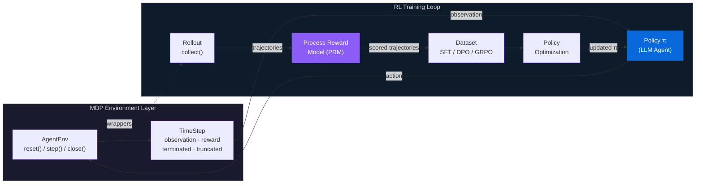

<div align="center">

# knowlyr-gym

### Gymnasium-Style Reinforcement Learning Framework<br/>for LLM Agent Training

**MDP Formalization · Three-Layer Process Reward Model · SFT / DPO / GRPO Policy Optimization**

*Formalized MDP environments, three-layer process reward, and complete policy optimization pipeline*

[Quick Start](#quick-start) · [Architecture](#architecture) · [Key Innovations](#key-innovations) · [Components](#components) · [Ecosystem](#ecosystem)

</div>

## What is knowlyr-gym?

knowlyr-gym is a **training infrastructure for LLM Agents** — not another inference framework. It answers three fundamental questions: *where to train* (Gymnasium-compatible environments), *how to evaluate* (three-layer Process Reward Model), and *how to optimize* (SFT / DPO / GRPO policy training). Environments produce trajectories, rewards assess quality, and trainers optimize policy — all connected through standardized data formats into a closed loop.

The framework formalizes LLM tool-use agent tasks as Markov Decision Processes $\langle \mathcal{S}, \mathcal{A}, T, R, \gamma \rangle$ and implements the complete reinforcement learning pipeline from environment interaction to policy optimization.

## Architecture



## Key Innovations

### Gymnasium-Compatible Environment Protocol

5 registered environments (`knowlyr/sandbox`, `knowlyr/conversation`, `knowlyr/engineering`, `knowlyr/advisory`, `knowlyr/discussion`) with 4 composable wrappers — extending the Gymnasium `reset()` / `step()` / `close()` pattern to LLM Agent scenarios with structured tool-call actions and natural language state spaces.

### DomainProfile — Domain-Agnostic Abstraction

Declarative domain configuration covering toolsets, tool categories, outcome rules, and scoring dimension weights. 7 built-in domains (coding, browser, conversation, engineering, advisory, discussion, generic) — add new domains without modifying core code.

### Three-Layer Process Reward Model

Step-level process reward $r_t = R(s_t, a_t)$ instead of sparse outcome reward. Three layers progressively improve evaluation quality:

| Layer | Method | Cost | Latency |
|-------|--------|------|---------|
| **Rule-based** | Redundancy, regression, info utilization, efficiency | ~0 | <1ms |
| **LLM-as-Judge** | Rubric-based multi-dimensional semantic scoring | ~$0.01/step | ~1s |
| **Human** | Calibration via human annotations | Offline | Offline |

### Policy Optimization — SFT / DPO / GRPO

Three methods spanning the full spectrum from behavioral cloning to online policy optimization, plus 6 agent-specific training enhancements: observation masking, step-weighted loss, trajectory chunking, curriculum learning, multi-turn formatting, and step-level GRPO.

## Quick Start

```python
from knowlyrcore import make

env = make("knowlyr/conversation")
ts = env.reset(task="Help user check order status")
while not ts.done:
    action = my_agent(ts.observation)   # π(a|s)
    ts = env.step(action)              # s', r, done
env.close()
```

```bash
pip install knowlyr-hub[all]
```

## Components

| Package | RL Role | Description |
|---------|---------|-------------|
| [**knowlyr-core**](packages/core/) | MDP Protocol | `AgentEnv` · `TimeStep` · `EnvWrapper` · `Registry` · `DomainProfile` |
| [**knowlyr-sandbox**](packages/sandbox/) | Environment | Docker sandbox execution · `SandboxEnv` · `ConversationEnv` |
| [**knowlyr-recorder**](packages/recorder/) | Trajectory Buffer | Agent log parsing · standardized trajectories · adapter registry |
| [**knowlyr-reward**](packages/reward/) | Reward Model | Three-layer PRM · Rubric scoring · preference pair construction |
| [**knowlyr-hub**](packages/hub/) | Rollout & Data | `collect()` sampling · `DatasetExporter` · Pipeline orchestration · CAS dedup · GDI ranking |
| [**knowlyr-trainer**](packages/trainer/) | Policy Optimization | SFT · DPO · GRPO · evaluation · inference bridge |

## Ecosystem

| Layer | Project | Description |
|:---|:---|:---|
| Discovery | **AI Dataset Radar** | Dataset competitive intelligence and trend analysis |
| Analysis | **DataRecipe** | Reverse engineering, schema extraction, cost estimation |
| Production | **DataSynth** / **DataLabel** | LLM batch synthesis / lightweight annotation |
| Quality | **DataCheck** | Rule validation, dedup detection, distribution analysis |
| Audit | **ModelAudit** | Distillation detection, model fingerprinting |
| Deliberation | **Crew** | Adversarial multi-agent deliberation · persistent memory evolution |
| Identity | **knowlyr-id** | Identity system + AI employee runtime |
| Agent Training | **knowlyr-gym** | Gymnasium-style RL framework for LLM agent training |

<div align="center">
<sub><a href="https://github.com/liuxiaotong">knowlyr</a> — gymnasium-style RL framework for LLM agent training</sub>
</div>
