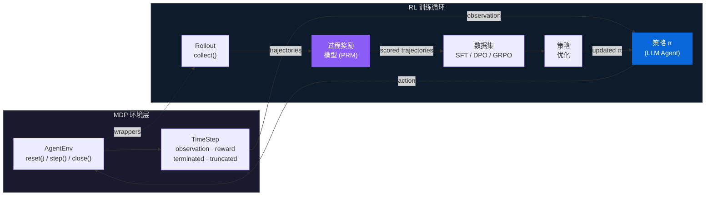

<div align="center">

# knowlyr-gym

### Gymnasium 风格强化学习框架<br/>Gymnasium-Style Reinforcement Learning Framework<br/>面向 LLM Agent 训练

**MDP 形式化 · 三层过程奖励模型 · SFT / DPO / GRPO 策略优化**

*形式化 MDP 环境、三层过程奖励、完整策略优化管线*

[快速开始](#快速开始) · [架构](#架构) · [核心创新](#核心创新) · [组件](#组件) · [生态系统](#生态系统)

</div>

## knowlyr-gym 是什么？ / What is knowlyr-gym?

knowlyr-gym 是 LLM Agent 的**训练基础设施**——不是又一个推理框架。它回答三个根本问题：*在哪练*（Gymnasium 兼容环境）、*怎么评*（三层过程奖励模型）、*如何优化*（SFT / DPO / GRPO 策略训练）。环境产出轨迹，奖励评估质量，训练器优化策略——三者通过标准化数据格式串联为闭环。

本框架将 LLM tool-use agent 任务形式化为马尔可夫决策过程 $\langle \mathcal{S}, \mathcal{A}, T, R, \gamma \rangle$，实现了从环境交互到策略优化的完整强化学习管线。

## 架构 / Architecture



## 核心创新 / Key Innovations

### Gymnasium 兼容环境协议 / Gymnasium-Compatible Environment Protocol

5 个注册环境（`knowlyr/sandbox`、`knowlyr/conversation`、`knowlyr/engineering`、`knowlyr/advisory`、`knowlyr/discussion`）搭配 4 个可组合 Wrapper——将 Gymnasium 的 `reset()` / `step()` / `close()` 模式扩展至 LLM Agent 场景，支持结构化 tool-call 动作空间和自然语言状态空间。

### DomainProfile — 领域无关抽象 / Domain-Agnostic Abstraction

声明式领域配置，涵盖工具集、工具类别、结果判定规则和评分维度权重。7 个内置领域（coding、browser、conversation、engineering、advisory、discussion、generic）——新增领域无需修改核心代码。

### 三层过程奖励模型 / Three-Layer Process Reward Model

步骤级过程奖励 $r_t = R(s_t, a_t)$，取代稀疏的结果奖励。三层架构逐层提升评估质量：

| 层 | 方法 | 成本 | 延迟 |
|-------|--------|------|---------|
| **规则层** | 冗余检测、回归检测、信息利用分析、效率分析 | ~0 | <1ms |
| **LLM-as-Judge** | 基于 Rubric 的多维度语义评分 | ~$0.01/步 | ~1s |
| **人工层** | 通过人工标注进行校准 | 离线 | 离线 |

### 策略优化 — SFT / DPO / GRPO / Policy Optimization

三种方法覆盖从行为克隆到在线策略优化的完整谱系，外加 6 项 Agent 专属训练增强：观测遮蔽、步骤加权损失、轨迹分块、课程学习、多轮格式化、步骤级 GRPO。

## 快速开始 / Quick Start

```python
from knowlyrcore import make

env = make("knowlyr/conversation")
ts = env.reset(task="帮用户查询订单状态")
while not ts.done:
    action = my_agent(ts.observation)   # π(a|s)
    ts = env.step(action)              # s', r, done
env.close()
```

```bash
pip install knowlyr-hub[all]
```

## 组件 / Components

| 包 | RL 角色 | 描述 |
|---------|---------|-------------|
| [**knowlyr-core**](packages/core/) | MDP 协议 | `AgentEnv` · `TimeStep` · `EnvWrapper` · `Registry` · `DomainProfile` |
| [**knowlyr-sandbox**](packages/sandbox/) | 环境 | Docker 沙箱执行 · `SandboxEnv` · `ConversationEnv` |
| [**knowlyr-recorder**](packages/recorder/) | 轨迹缓冲 | Agent 日志解析 · 标准化轨迹 · 适配器注册表 |
| [**knowlyr-reward**](packages/reward/) | 奖励模型 | 三层 PRM · Rubric 评分 · 偏好对构建 |
| [**knowlyr-hub**](packages/hub/) | Rollout 与数据 | `collect()` 采样 · `DatasetExporter` · Pipeline 编排 · CAS 去重 · GDI 排名 |
| [**knowlyr-trainer**](packages/trainer/) | 策略优化 | SFT · DPO · GRPO · 评估 · 推理桥 |

## 生态系统 / Ecosystem

| 层 | 项目 | 描述 |
|:---|:---|:---|
| 发现 | **AI Dataset Radar** | 数据集竞争情报、趋势分析 |
| 分析 | **DataRecipe** | 逆向分析、Schema 提取、成本估算 |
| 生产 | **DataSynth** / **DataLabel** | LLM 批量合成 / 轻量标注 |
| 质量 | **DataCheck** | 规则验证、重复检测、分布分析 |
| 审计 | **ModelAudit** | 蒸馏检测、模型指纹 |
| 协商 | **Crew** | 对抗式多智能体协商 · 持久记忆进化 |
| 身份 | **knowlyr-id** | 身份系统 + AI 员工运行时 |
| Agent 训练 | **knowlyr-gym** | Gymnasium 风格 RL 框架 · 过程奖励模型 · SFT/DPO/GRPO |

<div align="center">
<sub><a href="https://github.com/liuxiaotong">knowlyr</a> — Gymnasium 风格 LLM Agent 训练 RL 框架</sub>
</div>
