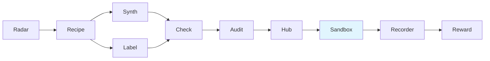

<div align="center">

# KnowlyrCore

**Agent 环境协议与共享数据模型 - Gym 风格环境注册表与领域配置**
**Gym-style agent environment protocol, registry, and domain profiles**

[](https://pypi.org/project/knowlyr-core/)
[](https://www.python.org/downloads/)
[](LICENSE)

[快速开始](#快速开始--quick-start) · [环境协议](#环境协议--environment-protocol) · [注册表](#注册表--registry) · [领域配置](#领域配置--domain-profiles) · [Knowlyr 生态](#ai-data-pipeline-生态)

</div>

---

**GitHub Topics**: `gym`, `agent-environment`, `registry`, `domain-profile`, `pydantic`, `mcp`

为 knowlyr-agent 生态提供统一的 Gym 风格环境协议、环境注册表和领域配置，是其余 5 个子包的共享基础。

## 核心能力 / Core Capabilities

```
AgentEnv 协议 → TimeStep 返回 → Registry 注册/查找 → DomainProfile 领域配置
```

### 设计特点 / Design Highlights

| 特点 | 说明 |
|------|------|
| **Gym 协议** | 借鉴 Gymnasium / BrowserGym，统一 reset/step/close 接口 |
| **类型安全** | Pydantic 数据模型，完整类型标注 |
| **可组合包装器** | EnvWrapper 基类，MaxSteps/Timeout/Reward/Recorder 自由叠加 |
| **多领域** | 7 个内置 DomainProfile：coding, browser, conversation, engineering, advisory, discussion, generic |
| **注册表** | register/make/list_envs，与 Gymnasium 一致的环境管理方式 |

## 安装 / Installation

```bash
pip install knowlyr-core
```

开发模式：

```bash
pip install knowlyr-core[dev]
```

## 快速开始 / Quick Start

### 环境协议 / Environment Protocol

```python
from knowlyrcore import AgentEnv, TimeStep, make, register

# 注册自定义环境
class MyEnv(AgentEnv):
    domain = "coding"

    def reset(self, *, task=None, seed=None) -> TimeStep:
        return TimeStep(observation="ready")

    def step(self, action: dict) -> TimeStep:
        return TimeStep(observation="done", terminated=True)

    def close(self): ...

    @property
    def available_tools(self) -> list[str]:
        return ["bash", "submit"]

register("my/env", MyEnv, domain="coding")
env = make("my/env")
ts = env.reset()
```

### 领域配置 / Domain Profiles

```python
from knowlyrcore import get_domain_profile, list_domain_profiles

# 查看所有领域
print(list_domain_profiles())
# ['coding', 'browser', 'conversation', 'engineering', 'advisory', 'discussion', 'generic']

# 获取领域工具列表
profile = get_domain_profile("coding")
for tool in profile.tools:
    print(f"{tool.name}: {tool.description}")
```

### 包装器组合 / Composable Wrappers

```python
from knowlyrcore.wrappers import MaxStepsWrapper, TimeoutWrapper

env = make("my/env")
env = MaxStepsWrapper(env, max_steps=30)
env = TimeoutWrapper(env, timeout=300)
```

## API 概览

| 模块 | 核心导出 | 说明 |
|------|---------|------|
| `env` | `AgentEnv`, `EnvWrapper` | 环境协议与包装器基类 |
| `timestep` | `TimeStep` | 统一返回类型 (observation/reward/terminated/truncated/info) |
| `registry` | `register`, `make`, `list_envs`, `spec` | 环境注册表 |
| `domain` | `DomainProfile`, `ToolSpec`, `get_domain_profile` | 领域配置 |
| `models` | `TaskInfo`, `ToolResult` | 共享数据模型 |
| `wrappers` | `MaxStepsWrapper`, `TimeoutWrapper`, `RewardWrapper`, `RecorderWrapper` | 内置包装器 |

## License

[MIT](LICENSE)

---

## AI Data Pipeline 生态

> 10 个工具覆盖 AI 数据工程全流程，均支持 CLI + MCP，可独立使用也可组合成流水线。

| 层 | 项目 | 说明 | 仓库 |
|---|---|---|---|
| 情报 | **AI Dataset Radar** | 数据集竞争情报、趋势分析 | [GitHub](https://github.com/liuxiaotong/ai-dataset-radar) |
| 分析 | **DataRecipe** | 逆向分析、Schema 提取、成本估算 | [GitHub](https://github.com/liuxiaotong/data-recipe) |
| 生产 | **DataSynth** | LLM 批量合成、种子数据扩充 | [GitHub](https://github.com/liuxiaotong/data-synth) |
| 生产 | **DataLabel** | 轻量标注工具、多标注员合并 | [GitHub](https://github.com/liuxiaotong/data-label) |
| 质检 | **DataCheck** | 规则验证、重复检测、分布分析 | [GitHub](https://github.com/liuxiaotong/data-check) |
| 质检 | **ModelAudit** | 蒸馏检测、模型指纹、身份验证 | [GitHub](https://github.com/liuxiaotong/model-audit) |
| Agent | **KnowlyrCore** | Gym 协议、注册表、领域配置 | You are here |
| Agent | **AgentSandbox** | Docker 执行沙箱、轨迹重放 | [GitHub](https://github.com/liuxiaotong/knowlyr-agent) |
| Agent | **AgentRecorder** | 标准化轨迹录制、多框架适配 | [GitHub](https://github.com/liuxiaotong/knowlyr-agent) |
| Agent | **AgentReward** | 过程级 Reward、Rubric 多维评估 | [GitHub](https://github.com/liuxiaotong/knowlyr-agent) |



---

<div align="center">
<sub>为 Agent 生态提供统一的环境协议与共享基础</sub>
</div>
