<div align="center">

# TrajectoryHub

**Agent 轨迹数据 Pipeline 编排层 - 串联全流程，产出可训练的数据集**
**Orchestrate the full pipeline: Task -> Sandbox -> Recorder -> Reward -> Export**

[](https://pypi.org/project/knowlyr-hub/)
[](https://www.python.org/downloads/)
[](LICENSE)
[](#mcp-server)

[快速开始](#快速开始--quick-start) · [Pipeline Flow](#pipeline-flow--流水线流程) · [导出格式](#export-formats--导出格式) · [MCP Server](#mcp-server--claude-integration) · [Data Pipeline 生态](#data-pipeline-生态--ecosystem)

</div>

---

**GitHub Topics**: `agent-trajectory`, `pipeline`, `orchestrator`, `rl-data`, `sft`, `dpo`, `code-agent`

knowlyr 生态的编排层。调用 agent-sandbox、agent-recorder、agent-reward、data-check、data-label 等原子项目，产出训练就绪的数据集。

## 核心能力 / Core Capabilities

```
Task (JSONL/SWE-bench) → Sandbox (执行) → Recorder (录制) → Reward (打分) → Export (SFT/DPO)
```

### 架构 / Architecture

```mermaid
graph TD
    Hub["🎯 agent-trajectory-hub<br/>(编排层 / Orchestrator)"]

    Hub --> Task["📋 Task Layer<br/>任务层"]
    Hub --> Exec["⚙️ Exec Layer<br/>执行层"]
    Hub --> Value["💎 Value Layer<br/>价值层"]

    Task --> TaskSource["TaskSource<br/>(JSONL / SWE-bench)"]
    Task --> Recipe["Recipe<br/>(复用)"]

    Exec --> Sandbox["Sandbox<br/>(agent-sandbox)"]
    Exec --> Recorder["Recorder<br/>(agent-recorder)"]
    Exec --> Reward["Reward<br/>(agent-reward)"]

    Value --> SFT["SFT Export"]
    Value --> DPO["DPO Export"]
    Value --> Publish["Publish<br/>HuggingFace"]

    Reward --> Check["Check<br/>(data-check)"]
    Reward --> Synth["Synth<br/>(data-synth)"]
    Reward --> Label["Label<br/>(data-label)"]

    style Hub fill:#0969da,color:#fff,stroke:#0969da
    style Task fill:#2da44e,color:#fff,stroke:#2da44e
    style Exec fill:#bf8700,color:#fff,stroke:#bf8700
    style Value fill:#8250df,color:#fff,stroke:#8250df
```



### 解决的问题 / Problems Solved

| 痛点 | 传统方案 | TrajectoryHub |
|------|----------|---------------|
| **编排复杂** | 手动串联 Sandbox → 录制 → 打分 → 导出 | 一条命令跑完全 Pipeline |
| **断点恢复** | 失败后从头跑 | Checkpoint 自动恢复 |
| **格式适配** | 手动转换 SFT / DPO / Benchmark | 内置多格式导出 |
| **并行调度** | 逐任务串行 | 多 Worker 并行执行 |

### 项目调用关系 / Project Dependencies

| 原子项目 | PyPI 包名 | 在 Hub 中的角色 |
|----------|-----------|----------------|
| **agent-sandbox** | `knowlyr-sandbox` | 可复现的代码执行环境 (Docker 沙箱) |
| **agent-recorder** | `knowlyr-recorder` | 标准化轨迹录制 (拦截 Agent <-> Sandbox 交互) |
| **agent-reward** | `knowlyr-reward` | 过程级 Reward 计算 (规则层 + 模型层 + 人工校准) |
| **data-check** | `knowlyr-datacheck` | 轨迹数据质检 (规则验证、重复检测) |
| **data-label** | `knowlyr-datalabel` | 偏好对的人工标注 + IAA 一致性验证 |
| **data-synth** | `knowlyr-datasynth` | Reward 模型层的 LLM-as-Judge |

## 安装 / Installation

```bash
pip install knowlyr-hub
```

可选依赖：

```bash
pip install knowlyr-hub[sandbox]    # 沙箱环境
pip install knowlyr-hub[recorder]   # 轨迹录制
pip install knowlyr-hub[reward]     # Reward 计算
pip install knowlyr-hub[check]      # 数据质检
pip install knowlyr-hub[mcp]        # MCP 服务器
pip install knowlyr-hub[all]        # 全部功能
```

## 快速开始 / Quick Start

### CLI 模式 / CLI Mode

```bash
# 运行完整 Pipeline
knowlyr-hub run tasks.jsonl -o ./output -f openhands -m claude-sonnet-4-20250514

# 从 checkpoint 恢复
knowlyr-hub run tasks.jsonl -o ./output --resume ./output/checkpoint.json

# 查看状态
knowlyr-hub status ./output

# 列出任务
knowlyr-hub tasks tasks.jsonl --language python --difficulty medium
```

<details>
<summary>输出示例</summary>

```
正在运行 Pipeline...
  任务源: tasks.jsonl (50 tasks)
  Agent: openhands / claude-sonnet-4-20250514
  并行: 4 workers
  进度: 50/50
✓ Pipeline 完成
  轨迹: ./output/trajectories.jsonl (100 条)
  偏好对: ./output/preferences.jsonl (75 对)
  耗时: 34m 12s
```

</details>

### 导出数据集 / Export Datasets

```bash
# 导出为 SFT 格式
knowlyr-hub export --format sft -t ./output/trajectories.jsonl -o ./export/sft_train.jsonl

# 导出为 DPO 格式
knowlyr-hub export --format dpo -t ./output/trajectories.jsonl -p ./output/preferences.jsonl -o ./export/dpo_train.jsonl

# 发布到 HuggingFace
knowlyr-hub publish -t ./output/trajectories.jsonl --repo-id username/my-dataset --generate-card
```

<details>
<summary>输出示例</summary>

```
正在导出 SFT 格式...
  输入: ./output/trajectories.jsonl
  过滤: reward >= 0.5
  输出: ./export/sft_train.jsonl
✓ 导出成功
  数量: 82 条
  平均 reward: 0.73
```

</details>

---

## Pipeline Flow / 流水线流程

```
1. Load Tasks          从 JSONL / SWE-bench 加载任务列表
       |
2. For each (Task x Agent):
       |
   2a. Create Sandbox  创建 Docker 沙箱环境 (agent-sandbox)
       |
   2b. Run Agent       在沙箱中运行 Agent (OpenHands / SWE-agent)
       |
   2c. Record          录制执行轨迹 (agent-recorder)
       |
   2d. Score           计算过程级 Reward (agent-reward)
       |
3. Build Pairs         构建偏好对 (同任务多轨迹按 reward 排序)
       |
4. Quality Check       运行数据质检 (data-check)
       |
5. Export              导出为 SFT / DPO / Benchmark 格式
```

---

## Export Formats / 导出格式

### SFT Format (监督微调)

```jsonc
// 每行一个 JSON
{
    "instruction": "Fix the bug in parser module",
    "input": "{\"repo\": \"owner/repo\", \"base_commit\": \"abc123\", ...}",
    "response": "Step 1:\nThought: Read the file\nAction: file_read /test.py\n...",
    "task_id": "repo__issue-123",
    "reward": 0.85,
    "metadata": {"agent_framework": "openhands", "agent_model": "claude-sonnet-4-20250514", "total_steps": 5}
}
```

### DPO Format (偏好学习)

```jsonc
// 每行一个 JSON
{
    "prompt": "Solve the following task:\n\nTask ID: repo__issue-123",
    "chosen": "Step 1:\nThought: ...\nAction: ...\n...",
    "rejected": "Step 1:\nThought: ...\nAction: ...\n...",
    "task_id": "repo__issue-123",
    "reward_margin": 0.55,
    "metadata": {
        "chosen_model": "claude-sonnet-4-20250514",
        "rejected_model": "gpt-4o",
        "chosen_reward": 0.85,
        "rejected_reward": 0.30
    }
}
```

### Benchmark Format (评测基准)

```jsonc
{
    "task_id": "repo__issue-123",
    "description": "Fix the bug in parser module",
    "repo": "owner/repo",
    "base_commit": "abc123",
    "test_command": "pytest tests/test_parser.py",
    "reference_trajectories": [...],
    "difficulty": "medium",
    "expected_reward_range": [0.3, 0.85]
}
```

---

## 任务管理 / Task Management

```bash
# 列出任务
knowlyr-hub tasks tasks.jsonl --language python --difficulty medium

# 查看 Pipeline 状态
knowlyr-hub status ./output
```

支持从多种来源加载任务：JSONL 文件、SWE-bench 数据集、自定义 TaskSource。

---

## MCP Server / Claude Integration

在 Claude Desktop / Claude Code 中直接使用。

### 配置 / Config

添加到 `~/Library/Application Support/Claude/claude_desktop_config.json`：

```json
{
  "mcpServers": {
    "knowlyr-hub": {
      "command": "uv",
      "args": ["--directory", "/path/to/agent-trajectory-hub", "run", "python", "-m", "trajectoryhub.mcp_server"]
    }
  }
}
```

### 可用工具 / Tools

| 工具 | 功能 |
|------|------|
| `run_pipeline` | 运行完整 Pipeline (Task -> Sandbox -> Recorder -> Reward -> Export) |
| `export_dataset` | 导出为指定格式 (SFT / DPO / Benchmark / HuggingFace) |
| `pipeline_status` | 查看 Pipeline 执行状态和进度 |

### 使用示例 / Usage Example

```
用户: 帮我用 tasks.jsonl 跑一轮 Pipeline，导出 DPO 格式

Claude: [调用 run_pipeline]
        Pipeline 运行中... 50/50 完成

        [调用 export_dataset]
        ✓ 数据集已导出:
        - 输出路径: ./export/dpo_train.jsonl
        - 偏好对数量: 75
```

---

## Data Pipeline 生态 / Ecosystem

TrajectoryHub 是 Data Pipeline 生态的编排层：

```mermaid
graph LR
    Radar["🔍 Radar<br/>情报发现"] --> Recipe["📋 Recipe<br/>逆向分析"]
    Recipe --> Synth["🔄 Synth<br/>数据合成"]
    Recipe --> Label["🏷️ Label<br/>数据标注"]
    Synth --> Check["✅ Check<br/>数据质检"]
    Label --> Check
    Check --> Audit["🔬 Audit<br/>模型审计"]
    Audit --> Hub["🎯 Hub<br/>编排层"]
    Hub --> Sandbox["📦 Sandbox<br/>执行沙箱"]
    Sandbox --> Recorder["📹 Recorder<br/>轨迹录制"]
    Recorder --> Reward["⭐ Reward<br/>过程打分"]
    style Hub fill:#0969da,color:#fff,stroke:#0969da
```



### 生态项目

| 层 | 项目 | 说明 | 仓库 |
|---|---|---|---|
| 情报 | **AI Dataset Radar** | 数据集竞争情报、趋势分析 | [GitHub](https://github.com/liuxiaotong/ai-dataset-radar) |
| 分析 | **DataRecipe** | 逆向分析、Schema 提取、成本估算 | [GitHub](https://github.com/liuxiaotong/data-recipe) |
| 生产 | **DataSynth** | LLM 批量合成、种子数据扩充 | [GitHub](https://github.com/liuxiaotong/data-synth) |
| 生产 | **DataLabel** | 轻量标注工具、多标注员合并 | [GitHub](https://github.com/liuxiaotong/data-label) |
| 质检 | **DataCheck** | 规则验证、重复检测、分布分析 | [GitHub](https://github.com/liuxiaotong/data-check) |
| 质检 | **ModelAudit** | 蒸馏检测、模型指纹、身份验证 | [GitHub](https://github.com/liuxiaotong/model-audit) |
| Agent | **AgentSandbox** | Docker 执行沙箱、轨迹重放 | [GitHub](https://github.com/liuxiaotong/agent-sandbox) |
| Agent | **AgentRecorder** | 标准化轨迹录制、多框架适配 | [GitHub](https://github.com/liuxiaotong/agent-recorder) |
| Agent | **AgentReward** | 过程级 Reward、Rubric 多维评估 | [GitHub](https://github.com/liuxiaotong/agent-reward) |
| 编排 | **TrajectoryHub** | Pipeline 编排、数据集导出 | You are here |

### 端到端工作流 / End-to-end Flow

```bash
# 1. Radar: 发现高价值数据集
knowlyr-radar scan --topic code-agent

# 2. DataRecipe: 分析数据集，生成 Schema
knowlyr-datarecipe deep-analyze tencent/CL-bench -o ./output

# 3. DataSynth: 合成种子任务
knowlyr-datasynth generate ./output/tencent_CL-bench/ -n 100

# 4. DataLabel: 人工校准种子数据
knowlyr-datalabel generate ./output/tencent_CL-bench/

# 5. DataCheck: 质量检查
knowlyr-datacheck validate ./output/tencent_CL-bench/

# 6. TrajectoryHub: 跑 Pipeline，产出训练数据
knowlyr-hub run tasks.jsonl -o ./output -f openhands -m claude-sonnet-4-20250514

# 7. Export: 导出 SFT / DPO 格式
knowlyr-hub export --format dpo -t ./output/trajectories.jsonl -o ./export/dpo_train.jsonl
```

### 十合一 MCP 配置 / Full MCP Config

```json
{
  "mcpServers": {
    "knowlyr-radar": {
      "command": "uv",
      "args": ["--directory", "/path/to/ai-dataset-radar", "run", "python", "-m", "radar.mcp_server"]
    },
    "knowlyr-datarecipe": {
      "command": "uv",
      "args": ["--directory", "/path/to/data-recipe", "run", "knowlyr-datarecipe-mcp"]
    },
    "knowlyr-datasynth": {
      "command": "uv",
      "args": ["--directory", "/path/to/data-synth", "run", "python", "-m", "datasynth.mcp_server"]
    },
    "knowlyr-datalabel": {
      "command": "uv",
      "args": ["--directory", "/path/to/data-label", "run", "python", "-m", "datalabel.mcp_server"]
    },
    "knowlyr-datacheck": {
      "command": "uv",
      "args": ["--directory", "/path/to/data-check", "run", "python", "-m", "datacheck.mcp_server"]
    },
    "knowlyr-hub": {
      "command": "uv",
      "args": ["--directory", "/path/to/agent-trajectory-hub", "run", "python", "-m", "trajectoryhub.mcp_server"]
    },
    "knowlyr-sandbox": {
      "command": "uv",
      "args": ["--directory", "/path/to/agent-sandbox", "run", "python", "-m", "sandbox.mcp_server"]
    },
    "knowlyr-recorder": {
      "command": "uv",
      "args": ["--directory", "/path/to/agent-recorder", "run", "python", "-m", "recorder.mcp_server"]
    },
    "knowlyr-reward": {
      "command": "uv",
      "args": ["--directory", "/path/to/agent-reward", "run", "python", "-m", "reward.mcp_server"]
    }
  }
}
```

---

## 命令参考

| 命令 | 功能 |
|------|------|
| `knowlyr-hub run <tasks>` | 运行完整 Pipeline |
| `knowlyr-hub export --format <fmt>` | 导出数据集 |
| `knowlyr-hub status <dir>` | 查看 Pipeline 状态 |
| `knowlyr-hub tasks <source>` | 列出/过滤任务 |
| `knowlyr-hub publish` | 发布到 HuggingFace |

### Run 选项

| 选项 | 说明 | 默认值 |
|------|------|--------|
| `-o, --output` | 输出目录 | `./output` |
| `-f, --framework` | Agent 框架 | `openhands` |
| `-m, --model` | LLM 模型 | `claude-sonnet-4-20250514` |
| `--max-steps` | 最大步数 | `30` |
| `-w, --workers` | 并行数 | `1` |
| `--resume` | 从 checkpoint 恢复 | - |

---

## API 使用

```python
from trajectoryhub import Pipeline, PipelineConfig
from trajectoryhub.config import TaskSource, AgentConfig

config = PipelineConfig(
    task_source=TaskSource(path="tasks.jsonl"),
    agents=[
        AgentConfig(framework="openhands", model="claude-sonnet-4-20250514"),
        AgentConfig(framework="openhands", model="gpt-4o"),
    ],
    output_dir="./output",
    parallel_workers=4,
)

pipeline = Pipeline(config)
result = pipeline.run()

print(f"完成: {result.completed}/{result.total_tasks}")
print(f"轨迹: {result.trajectories_path}")
print(f"偏好对: {result.preferences_path}")
```

### 导出数据集 / Export API

```python
from trajectoryhub import DatasetExporter

exporter = DatasetExporter(
    trajectories_dir="./output/trajectories.jsonl",
    preferences_dir="./output/preferences.jsonl",
)

# SFT 格式
exporter.export_sft("./export/sft_train.jsonl")

# DPO 格式
exporter.export_dpo("./export/dpo_train.jsonl")

# 评测基准
exporter.export_benchmark("./export/benchmark.jsonl")

# 生成 Dataset Card
card = exporter.generate_datacard()
```

---

## 项目架构

```
src/trajectoryhub/
├── __init__.py      # 包入口
├── config.py        # Pipeline 配置 (Pydantic models)
├── pipeline.py      # 核心编排器 (Pipeline + PipelineResult)
├── tasks.py         # 任务加载与管理 (Task + TaskLoader)
├── exporter.py      # 数据集导出 (SFT / DPO / Benchmark / HuggingFace)
├── cli.py           # CLI 命令行 (Click)
└── mcp_server.py    # MCP Server (3 tools)
```

---

## License

[MIT](LICENSE)

---

<div align="center">
<sub>面向 Code Agent 的 RL 环境，产出带过程级 Reward 的执行轨迹数据</sub>
</div>
