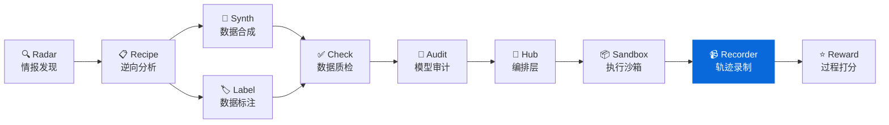
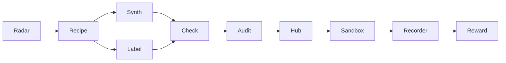

<div align="center">

# AgentRecorder

**Agent 轨迹录制工具 - 将 Agent 框架日志转换为标准化轨迹格式**
**Convert agent framework logs into a standardized trajectory format**

[](https://pypi.org/project/knowlyr-recorder/)
[](https://www.python.org/downloads/)
[](LICENSE)
[](#mcp-server)

[快速开始](#快速开始) · [适配器模式](#支持的框架) · [Schema 文档](#schema-文档) · [MCP Server](#mcp-server) · [Data Pipeline 生态](#data-pipeline-生态)

</div>

---

**GitHub Topics**: `agent`, `trajectory`, `recorder`, `openhands`, `swe-agent`, `mcp`, `benchmark`

将 OpenHands、SWE-agent 等 Agent 框架的执行日志转换为统一的标准化轨迹格式，便于分析、对比和复现。

## 核心能力 / Core Capabilities

```
Agent 日志 (OpenHands/SWE-agent/...) → 适配器解析 → 标准化 Trajectory → JSONL 输出
```

### 输入 / 输出示例 / Input & Output Samples

```jsonc
// 输入: OpenHands 日志 (action/observation)
{"action": "run", "args": {"command": "cat tests/test_urls.py"}, "message": "Let me look at the failing test"}
{"observation": "run", "content": "...", "extras": {"exit_code": 0}}

// 输出: 标准化 Trajectory JSONL
{"task":{"task_id":"django__django-11099","description":"Fix URL resolver","type":"bug_fix"},"agent":"openhands","model":"claude-sonnet-4-20250514","steps":[{"step_id":1,"thought":"Let me look at the failing test","tool_call":{"name":"bash","parameters":{"command":"cat tests/test_urls.py"}},"tool_result":{"output":"...","exit_code":0}}],"outcome":{"success":true,"tests_passed":42,"total_steps":8}}
```

### 解决的问题 / Problems Solved

| 痛点 | 现状 | AgentRecorder |
|------|------|---------------|
| **格式不统一** | 每个框架自定义日志格式 | 统一 Trajectory Schema |
| **难以对比** | 不同框架结果无法直接比较 | 标准化后可直接对比 |
| **复现困难** | 日志缺乏结构化 | 完整记录每步 thought/action/result |
| **分析耗时** | 手动解析各种日志 | 一键批量转换 |

### 设计特点 / Design Highlights

| 特点 | 说明 |
|------|------|
| **适配器模式** | 每个 Agent 框架一个适配器，易于扩展 |
| **标准化 Schema** | 统一的 Pydantic 数据模型，类型安全 |
| **JSONL 输出** | 一行一条轨迹，便于流式处理 |
| **CLI + MCP** | 命令行和 MCP Server 双入口 |

## 安装 / Installation

```bash
pip install knowlyr-recorder
```

可选依赖：

```bash
pip install knowlyr-recorder[mcp]   # MCP 服务器
pip install knowlyr-recorder[dev]   # 开发依赖
pip install knowlyr-recorder[all]   # 全部功能
```

## 快速开始 / Quick Start

### CLI 使用 / CLI Usage

```bash
# 转换单个日志文件
knowlyr-recorder convert ./logs/output.jsonl -f openhands -o trajectory.jsonl

# 批量转换目录
knowlyr-recorder batch ./logs/ -f openhands -o trajectories.jsonl

# 验证日志格式
knowlyr-recorder validate ./logs/output.jsonl

# 查看 Schema
knowlyr-recorder schema
```

<details>
<summary>输出示例</summary>

```
正在转换 ./logs/output.jsonl ...
  Agent 框架: openhands
  日志行数: 326
  解析步骤: 42
✓ 转换成功: trajectory.jsonl
  轨迹数量: 1
  总步骤数: 42
  耗时: 1.2s
```

</details>

### Python API 使用 / Python API

```python
from agentrecorder import Recorder
from agentrecorder.adapters import OpenHandsAdapter

# 创建录制器
recorder = Recorder(OpenHandsAdapter())

# 转换单个文件
trajectory = recorder.convert("path/to/log.jsonl")

# 批量转换
trajectories = recorder.convert_batch("path/to/logs/")

# 保存为 JSONL
trajectory.to_jsonl("output/trajectories.jsonl")
```

<details>
<summary>输出示例</summary>

```
>>> trajectory = recorder.convert("path/to/log.jsonl")
>>> print(f"步骤数: {trajectory.outcome.total_steps}")
步骤数: 42
>>> print(f"Token 用量: {trajectory.outcome.total_tokens}")
Token 用量: 12500
>>> trajectory.to_jsonl("output/trajectories.jsonl")
✓ 已保存: output/trajectories.jsonl
```

</details>

---

## 支持的框架 / Supported Frameworks

| 框架 | 状态 | 适配器 | 日志格式 |
|------|------|--------|----------|
| [OpenHands](https://github.com/All-Hands-AI/OpenHands) | Stub | `OpenHandsAdapter` | JSONL (action/observation) |
| [SWE-agent](https://github.com/princeton-nlp/SWE-agent) | Stub | `SWEAgentAdapter` | JSON (history/info) |
| Aider | 计划中 | - | - |
| Moatless | 计划中 | - | - |

### 添加新适配器 / Adding New Adapters

```python
from agentrecorder.adapters.base import BaseAdapter
from agentrecorder.schema import Trajectory

class MyAgentAdapter(BaseAdapter):
    def parse(self, log_path: str) -> Trajectory:
        # 实现日志解析逻辑
        ...

    def validate(self, log_path: str) -> bool:
        # 实现格式验证逻辑
        ...
```

---

## Schema 文档 / Schema Documentation

### Trajectory 数据模型

```
Trajectory
├── task: TaskInfo          # 任务信息
│   ├── task_id             # 任务 ID
│   ├── description         # 任务描述
│   ├── type                # 任务类型 (bug_fix, code_edit, ...)
│   ├── language            # 编程语言
│   ├── difficulty          # 难度等级
│   ├── repo                # 目标仓库
│   ├── base_commit         # 基础 commit
│   └── test_command        # 测试命令
├── agent: str              # Agent 框架名称
├── model: str              # LLM 模型名称
├── steps: list[Step]       # 执行步骤列表
│   └── Step
│       ├── step_id         # 步骤编号
│       ├── thought         # Agent 思考过程
│       ├── tool_call       # 工具调用
│       │   ├── name        # 工具名称
│       │   └── parameters  # 调用参数
│       ├── tool_result     # 工具结果
│       │   ├── output      # 输出内容
│       │   ├── exit_code   # 退出码
│       │   └── error       # 错误信息
│       ├── timestamp       # 时间戳
│       └── token_count     # Token 消耗
├── outcome: Outcome        # 执行结果
│   ├── success             # 是否成功
│   ├── tests_passed        # 通过测试数
│   ├── tests_failed        # 失败测试数
│   ├── total_steps         # 总步骤数
│   └── total_tokens        # 总 Token 数
└── metadata: dict          # 额外元数据
```

### JSONL 输出示例

```jsonl
{"task":{"task_id":"django__django-11099","description":"Fix URL resolver","type":"bug_fix","language":"python","difficulty":"medium","repo":"django/django","base_commit":"abc123","test_command":"python -m pytest tests/"},"agent":"openhands","model":"claude-sonnet-4-20250514","steps":[{"step_id":1,"thought":"Let me look at the failing test","tool_call":{"name":"bash","parameters":{"command":"cat tests/test_urls.py"}},"tool_result":{"output":"...","exit_code":0,"error":null},"timestamp":"2026-01-15T10:30:00Z","token_count":150}],"outcome":{"success":true,"tests_passed":42,"tests_failed":0,"total_steps":8,"total_tokens":12500},"metadata":{"run_id":"run-001"}}
```

---

## MCP Server / Claude Integration

在 Claude Desktop / Claude Code 中直接使用。

### 配置 / Config

添加到 `~/Library/Application Support/Claude/claude_desktop_config.json`：

```json
{
  "mcpServers": {
    "knowlyr-recorder": {
      "command": "uv",
      "args": ["--directory", "/path/to/agent-recorder", "run", "python", "-m", "agentrecorder.mcp_server"]
    }
  }
}
```

### 可用工具 / Tools

| 工具 | 功能 |
|------|------|
| `convert_logs` | 将 Agent 日志转换为标准化轨迹格式 |
| `validate_logs` | 验证日志文件格式 |
| `get_schema` | 返回轨迹的 JSON Schema 定义 |

### 使用示例 / Usage Example

```
用户: 帮我把 ./logs/openhands_output.jsonl 转成标准轨迹

Claude: [调用 convert_logs]
        正在解析 OpenHands 日志...

        [调用 validate_logs]
        ✓ 转换成功:
        - 输出路径: ./trajectories/trajectory.jsonl
        - 步骤数: 42
        - Token 用量: 12,500
```

---

## Data Pipeline 生态 / Ecosystem

AgentRecorder 是 AI Data Pipeline 生态的轨迹录制组件：



### 生态项目

| 层 | 项目 | 说明 | 仓库 |
|---|---|---|---|
| 情报 | **AI Dataset Radar** | 数据集竞争情报、趋势分析 | [GitHub](https://github.com/liuxiaotong/ai-dataset-radar) |
| 分析 | **DataRecipe** | 逆向分析、Schema 提取、成本估算 | [GitHub](https://github.com/liuxiaotong/data-recipe) |
| 生产 | **DataSynth** | LLM 批量合成、种子数据扩充 | [GitHub](https://github.com/liuxiaotong/data-synth) |
| 生产 | **DataLabel** | 轻量标注工具、多标注员合并 | [GitHub](https://github.com/liuxiaotong/data-label) |
| 质检 | **DataCheck** | 规则验证、重复检测、分布分析 | [GitHub](https://github.com/liuxiaotong/data-check) |
| 质检 | **ModelAudit** | 蒸馏检测、模型指纹、身份验证 | [GitHub](https://github.com/liuxiaotong/model-audit) |
| Agent | **AgentSandbox** | Docker 执行沙箱、轨迹重放 | [GitHub](https://github.com/liuxiaotong/agent-sandbox) |
| Agent | **AgentRecorder** | 标准化轨迹录制、多框架适配 | You are here |
| Agent | **AgentReward** | 过程级 Reward、Rubric 多维评估 | [GitHub](https://github.com/liuxiaotong/agent-reward) |
| 编排 | **TrajectoryHub** | Pipeline 编排、数据集导出 | [GitHub](https://github.com/liuxiaotong/agent-trajectory-hub) |

### 端到端工作流 / End-to-end Flow

```bash
# 1. DataRecipe: 分析数据集，生成 Schema 和样例
knowlyr-datarecipe deep-analyze tencent/CL-bench -o ./output

# 2. DataLabel: 生成标注界面，人工标注/校准种子数据
knowlyr-datalabel generate ./output/tencent_CL-bench/

# 3. DataSynth: 基于种子数据批量合成
knowlyr-datasynth generate ./output/tencent_CL-bench/ -n 1000

# 4. DataCheck: 质量检查
knowlyr-datacheck validate ./output/tencent_CL-bench/

# 5. TrajectoryHub: 管理轨迹数据集
knowlyr-trajhub list

# 6. AgentSandbox: 在沙箱中执行 Agent
knowlyr-sandbox run --task django__django-11099

# 7. AgentRecorder: 录制并转换轨迹
knowlyr-recorder convert ./logs/output.jsonl -f openhands -o trajectory.jsonl

# 8. AgentReward: 评估轨迹质量
knowlyr-reward score ./trajectory.jsonl
```

### 十合一 MCP 配置 / Full MCP Config

```json
{
  "mcpServers": {
    "knowlyr-datarecipe": {
      "command": "uv",
      "args": ["--directory", "/path/to/data-recipe", "run", "knowlyr-datarecipe-mcp"]
    },
    "knowlyr-datalabel": {
      "command": "uv",
      "args": ["--directory", "/path/to/data-label", "run", "python", "-m", "datalabel.mcp_server"]
    },
    "knowlyr-datasynth": {
      "command": "uv",
      "args": ["--directory", "/path/to/data-synth", "run", "python", "-m", "datasynth.mcp_server"]
    },
    "knowlyr-datacheck": {
      "command": "uv",
      "args": ["--directory", "/path/to/data-check", "run", "python", "-m", "datacheck.mcp_server"]
    },
    "knowlyr-trajhub": {
      "command": "uv",
      "args": ["--directory", "/path/to/agent-trajectory-hub", "run", "python", "-m", "trajhub.mcp_server"]
    },
    "knowlyr-sandbox": {
      "command": "uv",
      "args": ["--directory", "/path/to/agent-sandbox", "run", "python", "-m", "agentsandbox.mcp_server"]
    },
    "knowlyr-recorder": {
      "command": "uv",
      "args": ["--directory", "/path/to/agent-recorder", "run", "python", "-m", "agentrecorder.mcp_server"]
    },
    "knowlyr-reward": {
      "command": "uv",
      "args": ["--directory", "/path/to/agent-reward", "run", "python", "-m", "agentreward.mcp_server"]
    }
  }
}
```

---

## 命令参考

| 命令 | 功能 |
|------|------|
| `knowlyr-recorder convert <log> -f <framework>` | 转换单个日志文件 |
| `knowlyr-recorder validate <log>` | 验证日志格式 |
| `knowlyr-recorder batch <dir> -f <framework> -o <out>` | 批量转换 |
| `knowlyr-recorder schema` | 输出 JSON Schema |

---

## API 使用

```python
from agentrecorder import Recorder
from agentrecorder.adapters import OpenHandsAdapter

# 创建录制器
recorder = Recorder(OpenHandsAdapter())

# 转换单个文件
trajectory = recorder.convert("path/to/log.jsonl")

# 批量转换
trajectories = recorder.convert_batch("path/to/logs/")

# 保存为 JSONL
trajectory.to_jsonl("output/trajectories.jsonl")

# 从 JSONL 加载
from agentrecorder.schema import Trajectory
loaded = Trajectory.from_jsonl("output/trajectories.jsonl")

print(f"步骤数: {loaded.outcome.total_steps}")
print(f"成本: {loaded.outcome.total_tokens} tokens")
```

---

## 项目架构

```
src/agentrecorder/
├── __init__.py          # 包入口
├── schema.py            # 标准化轨迹数据模型
├── recorder.py          # 核心录制器
├── cli.py               # CLI 命令行
├── mcp_server.py        # MCP Server (3 工具)
└── adapters/
    ├── __init__.py      # 适配器注册
    ├── base.py          # 适配器基类
    ├── openhands.py     # OpenHands 适配器
    └── sweagent.py      # SWE-agent 适配器
```

---

## License

[MIT](LICENSE)

---

## AI Data Pipeline 生态

> 10 个工具覆盖 AI 数据工程全流程，均支持 CLI + MCP，可独立使用也可组合成流水线。

| 层 | 项目 | 说明 | 仓库 |
|---|---|---|---|
| 情报 | **AI Dataset Radar** | 数据集竞争情报、趋势分析 | [GitHub](https://github.com/liuxiaotong/ai-dataset-radar) |
| 分析 | **DataRecipe** | 逆向分析、Schema 提取、成本估算 | [GitHub](https://github.com/liuxiaotong/data-recipe) |
| 生产 | **DataSynth** | LLM 批量合成、种子数据扩充 | [GitHub](https://github.com/liuxiaotong/data-synth) |
| 生产 | **DataLabel** | 轻量标注工具、多标注员合并 | [GitHub](https://github.com/liuxiaotong/data-label) |
| 质检 | **DataCheck** | 规则验证、重复检测、分布分析 | [GitHub](https://github.com/liuxiaotong/data-check) |
| 质检 | **ModelAudit** | 蒸馏检测、模型指纹、身份验证 | [GitHub](https://github.com/liuxiaotong/model-audit) |
| Agent | **AgentSandbox** | Docker 执行沙箱、轨迹重放 | [GitHub](https://github.com/liuxiaotong/agent-sandbox) |
| Agent | **AgentRecorder** | 标准化轨迹录制、多框架适配 | You are here |
| Agent | **AgentReward** | 过程级 Reward、Rubric 多维评估 | [GitHub](https://github.com/liuxiaotong/agent-reward) |
| 编排 | **TrajectoryHub** | Pipeline 编排、数据集导出 | [GitHub](https://github.com/liuxiaotong/agent-trajectory-hub) |



---

<div align="center">
<sub>将 Agent 执行日志转化为可分析、可复现的标准化轨迹</sub>
</div>
