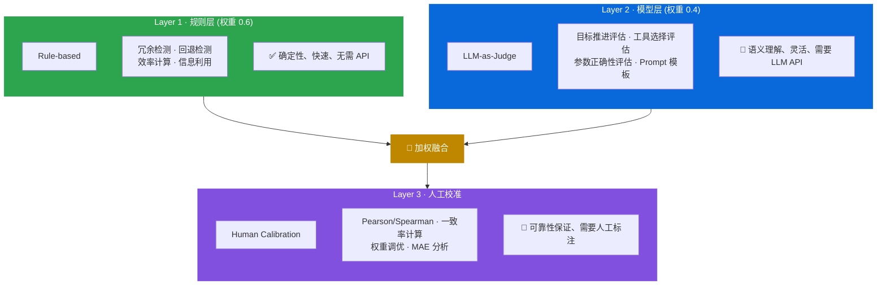
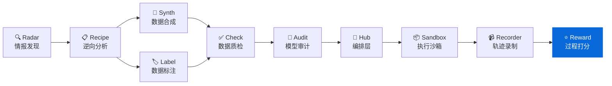

<div align="center">

# AgentReward

**过程级 Reward 计算引擎 - 评估 Agent 不仅做对了什么，还评估怎么做的**
**Process-level rubric-based reward engine for Code Agent trajectories**

[](https://pypi.org/project/knowlyr-reward/)
[](https://www.python.org/downloads/)
[](LICENSE)
[](#mcp-server)

[快速开始](#快速开始) · [三层架构](#三层架构) · [Rubric 体系](#rubric-体系) · [MCP Server](#mcp-server) · [Data Pipeline 生态](#data-pipeline-生态)

</div>

---

**GitHub Topics**: `agent-reward`, `process-reward`, `rubric`, `llm-judge`, `rlhf`, `code-agent`

对 Agent 轨迹的每一步计算多维 Rubric Reward，支持规则层 + 模型层 + 人工校准。用于 RLHF/DPO 训练数据的偏好对构建。

## 核心能力 / Core Capabilities

```
Agent 轨迹 (N步) → 逐步评估 → 过程分 + 结果分 → 偏好对 → RLHF/DPO 训练
```

### 解决的问题 / Problems Solved

| 痛点 | 传统方案 | AgentReward |
|------|----------|-------------|
| **评估粒度** | 只看最终结果 pass/fail | 每一步都有多维分数 |
| **Reward 信号** | 稀疏 (0/1) | 密集 (每步 0.0-1.0) |
| **可解释性** | 黑盒分数 | 按 Rubric 拆解 + 理由 |
| **偏好构建** | 手动标注 | 自动从 Reward 排序生成 |
| **可靠性** | 纯 LLM 判断不稳定 | 规则兜底 + 模型增强 + 人工校准 |

## 安装 / Installation

```bash
pip install knowlyr-reward
```

可选依赖：

```bash
pip install knowlyr-reward[llm]    # LLM-as-Judge (Anthropic + OpenAI)
pip install knowlyr-reward[stats]  # 统计校准 (numpy + scipy)
pip install knowlyr-reward[mcp]    # MCP 服务器
pip install knowlyr-reward[all]    # 全部功能
```

## 快速开始 / Quick Start

### Python API

```python
from agentreward import RewardEngine, TrajectoryReward
from agentreward.config import RewardConfig

# 准备轨迹数据
trajectory = {
    "task": "修复 test_login.py 中的断言错误",
    "steps": [
        {"tool": "Read", "params": {"file_path": "/src/test_login.py"}, "output": "..."},
        {"tool": "Grep", "params": {"pattern": "assert"}, "output": "line 42: assert x == y"},
        {"tool": "Edit", "params": {"file_path": "/src/test_login.py",
                                     "old_string": "assert x == y",
                                     "new_string": "assert x == expected_y"}},
    ],
    "outcome": {"success": True, "tests_passed": 10, "tests_total": 10},
}

# 计算 Reward
engine = RewardEngine()
result = engine.score(trajectory)

print(f"总分: {result.total_score:.4f}")
print(f"结果分: {result.outcome_score:.4f}")
print(f"过程分: {result.process_score:.4f}")

for sr in result.step_rewards:
    print(f"  Step {sr.step_id}: {sr.total_score:.4f} {sr.rubric_scores}")
```

<details>
<summary>输出示例</summary>

```
总分: 0.8720
结果分: 1.0000
过程分: 0.7440
  Step 1: 0.8500 {'goal_progress': 0.8, 'tool_choice': 0.9, 'param_correctness': 0.9, 'info_utilization': 0.7, 'non_redundancy': 1.0}
  Step 2: 0.7200 {'goal_progress': 0.6, 'tool_choice': 0.8, 'param_correctness': 0.8, 'info_utilization': 0.6, 'non_redundancy': 0.9}
  Step 3: 0.9100 {'goal_progress': 0.9, 'tool_choice': 1.0, 'param_correctness': 0.9, 'info_utilization': 0.9, 'non_redundancy': 1.0}
```

</details>

### CLI 命令行

```bash
# 评估单条轨迹
knowlyr-reward score trajectory.json

# 比较多条轨迹
knowlyr-reward compare traj_a.json traj_b.json traj_c.json

# 构建偏好对
knowlyr-reward preferences trajectories_by_task.json -o pairs.json
```

<details>
<summary>输出示例</summary>

```
正在评估轨迹: trajectory.json
  步骤数: 5
  模型: claude-sonnet-4-20250514
  进度: 5/5
✓ 评估完成
  总分: 0.8720
  过程分: 0.7440
  结果分: 1.0000
  耗时: 3.2s
```

</details>

---

## 三层架构 / Three-Layer Architecture



**为什么需要三层？**
- 规则层：快速、确定性、零成本，覆盖可量化的维度（冗余、回退、效率）
- 模型层：理解语义，评估"目标推进"等需要理解能力的维度
- 人工层：校准前两层的输出，确保与人类判断一致

---

## Rubric 体系 / Rubric System

每条轨迹的每一步按 5 个维度评估：

| Rubric | 名称 | 权重 | 评估方式 | 说明 |
|--------|------|------|----------|------|
| `goal_progress` | 目标推进 | 0.30 | model | 这一步是否推进了任务目标？ |
| `tool_choice` | 工具选择 | 0.20 | model | 选择的工具是否合理？ |
| `param_correctness` | 参数正确性 | 0.20 | model | 工具调用的参数是否正确？ |
| `info_utilization` | 信息利用 | 0.15 | rule | 是否利用了之前获得的信息？ |
| `non_redundancy` | 非冗余性 | 0.15 | rule | 这一步是否是非冗余操作？ |

### 自定义 Rubric

```python
from agentreward.rubrics import Rubric, RubricSet

custom_rubrics = RubricSet(rubrics=[
    Rubric(id="safety", name="安全性", description="操作是否安全？",
           weight=0.4, evaluator="rule"),
    Rubric(id="creativity", name="创造性", description="方案是否有创意？",
           weight=0.6, evaluator="model"),
])
```

---

## 校准方法 / Calibration Methodology

校准流程：

1. **收集人工标注**: 对 50-100 条轨迹由人工专家评分
2. **计算相关性**: Pearson r (线性)、Spearman rho (排序)、一致率
3. **调优权重**: 根据相关性结果调整 rule_weight / model_weight
4. **迭代**: 重复直到 Spearman rho > 0.8

```python
from agentreward.calibration import calibrate

result = calibrate(
    reward_scores=[0.8, 0.6, 0.9, 0.3, 0.7],
    human_scores=[0.85, 0.55, 0.95, 0.25, 0.65],
)

print(f"Pearson r: {result.pearson_r:.4f}")
print(f"Spearman rho: {result.spearman_rho:.4f}")
print(f"Agreement rate: {result.agreement_rate:.4f}")
```

### 校准指标参考

| 指标 | 合格 | 良好 | 优秀 |
|------|------|------|------|
| Pearson r | > 0.5 | > 0.7 | > 0.85 |
| Spearman rho | > 0.5 | > 0.7 | > 0.85 |
| Agreement rate | > 0.6 | > 0.75 | > 0.9 |

---

## 偏好对构建 / Preference Pair Construction

用于 RLHF / DPO 训练：

```python
from agentreward.preferences import build_preferences

# 按任务分组的轨迹 (已含 reward 分数)
trajectories_by_task = {
    "task_001": [
        {"id": "traj_a", "reward": 0.9, "step_count": 5},
        {"id": "traj_b", "reward": 0.3, "step_count": 12},
        {"id": "traj_c", "reward": 0.7, "step_count": 8},
    ],
}

pairs = build_preferences(trajectories_by_task, min_margin=0.1)
for p in pairs:
    print(f"{p.chosen_trajectory_id} > {p.rejected_trajectory_id} (margin={p.margin():.3f})")
```

---

## MCP Server / Claude Integration

在 Claude Desktop / Claude Code 中直接使用。

### 配置 / Config

添加到 `~/Library/Application Support/Claude/claude_desktop_config.json`：

```json
{
  "mcpServers": {
    "knowlyr-reward": {
      "command": "uv",
      "args": ["--directory", "/path/to/agent-reward", "run", "python", "-m", "agentreward.mcp_server"]
    }
  }
}
```

### 可用工具 / Tools

| 工具 | 功能 |
|------|------|
| `score_trajectory` | 对单条轨迹计算过程级 Reward |
| `build_preferences` | 从多条轨迹构建偏好对 |
| `calibrate_reward` | 将自动 Reward 与人工标注校准 |
| `list_rubrics` | 列出可用的评估 Rubric |

### 使用示例 / Usage Example

```
用户: 帮我评估 ./trajectories/task_001.json 的 Agent 轨迹

Claude: [调用 score_trajectory]
        评估轨迹 (5 步)...

        ✓ 评估完成:
        - 总分: 0.8720
        - 过程分: 0.7440
        - 结果分: 1.0000
        - Step 1: 0.85 | Step 2: 0.72 | Step 3: 0.91
```

---

## Data Pipeline 生态 / Ecosystem

AgentReward 是 Data Pipeline 生态的 Reward 组件：



### 生态项目

| 层 | 项目 | 说明 | 仓库 |
|---|---|---|---|
| 情报 | **AI Dataset Radar** | 数据集竞争情报、趋势分析 | [GitHub](https://github.com/liuxiaotong/ai-dataset-radar) |
| 分析 | **DataRecipe** | 逆向分析、Schema 提取、成本估算 | [GitHub](https://github.com/liuxiaotong/data-recipe) |
| 生产 | **DataSynth** | LLM 批量合成、种子数据扩充 | [GitHub](https://github.com/liuxiaotong/data-synth) |
| 生产 | **DataLabel** | 轻量标注工具、多标注员合并 | [GitHub](https://github.com/liuxiaotong/data-label) |
| 质检 | **DataCheck** | 规则验证、重复检测、分布分析 | [GitHub](https://github.com/liuxiaotong/data-check) |
| 质检 | **ModelAudit** | 蒸馏检测、模型指纹、身份验证 | [GitHub](https://github.com/liuxiaotong/model-audit) |
| Agent | **AgentSandbox** | Docker 执行沙箱、轨迹重放 | [GitHub](https://github.com/liuxiaotong/agent-sandbox) |
| Agent | **AgentRecorder** | 标准化轨迹录制、多框架适配 | [GitHub](https://github.com/liuxiaotong/agent-recorder) |
| Agent | **AgentReward** | 过程级 Reward、Rubric 多维评估 | You are here |
| 编排 | **TrajectoryHub** | Pipeline 编排、数据集导出 | [GitHub](https://github.com/liuxiaotong/agent-trajectory-hub) |

### 端到端工作流 / End-to-end Flow

```bash
# 1. Radar: 发现高质量数据集
knowlyr-radar scan --domain code-agent

# 2. DataRecipe: 分析数据集，生成 Schema 和样例
knowlyr-datarecipe deep-analyze tencent/CL-bench -o ./output

# 3. DataSynth: 基于种子数据批量合成
knowlyr-datasynth generate ./output/tencent_CL-bench/ -n 1000

# 4. DataLabel: 人工标注/校准种子数据
knowlyr-datalabel generate ./output/tencent_CL-bench/

# 5. DataCheck: 质量检查
knowlyr-datacheck validate ./output/tencent_CL-bench/

# 6. Recorder: 录制 Agent 执行轨迹
knowlyr-recorder record --task task_001.json

# 7. Hub: 管理轨迹数据
knowlyr-hub import ./trajectories/

# 8. Sandbox: 安全回放验证
knowlyr-sandbox replay trajectory_001.json

# 9. AgentReward: 计算过程级 Reward + 构建偏好对
knowlyr-reward score trajectory_001.json
knowlyr-reward preferences trajectories_by_task.json -o pairs.json
```

### 全家桶 MCP 配置 / Full MCP Config

```json
{
  "mcpServers": {
    "knowlyr-radar": {
      "command": "uv",
      "args": ["--directory", "/path/to/ai-dataset-radar", "run", "knowlyr-radar-mcp"]
    },
    "knowlyr-datarecipe": {
      "command": "uv",
      "args": ["--directory", "/path/to/data-recipe", "run", "knowlyr-datarecipe-mcp"]
    },
    "knowlyr-datasynth": {
      "command": "uv",
      "args": ["--directory", "/path/to/data-synth", "run", "python", "-m", "datasynth.mcp_server"]
    },
    "knowlyr-datalabel": {
      "command": "uv",
      "args": ["--directory", "/path/to/data-label", "run", "python", "-m", "datalabel.mcp_server"]
    },
    "knowlyr-datacheck": {
      "command": "uv",
      "args": ["--directory", "/path/to/data-check", "run", "python", "-m", "datacheck.mcp_server"]
    },
    "knowlyr-hub": {
      "command": "uv",
      "args": ["--directory", "/path/to/agent-trajectory-hub", "run", "python", "-m", "trajhub.mcp_server"]
    },
    "knowlyr-sandbox": {
      "command": "uv",
      "args": ["--directory", "/path/to/agent-sandbox", "run", "python", "-m", "sandbox.mcp_server"]
    },
    "knowlyr-recorder": {
      "command": "uv",
      "args": ["--directory", "/path/to/agent-recorder", "run", "python", "-m", "recorder.mcp_server"]
    },
    "knowlyr-reward": {
      "command": "uv",
      "args": ["--directory", "/path/to/agent-reward", "run", "python", "-m", "agentreward.mcp_server"]
    }
  }
}
```

---

## 命令参考

| 命令 | 功能 |
|------|------|
| `knowlyr-reward score <file>` | 评估单条轨迹 |
| `knowlyr-reward compare <files...>` | 比较多条轨迹 |
| `knowlyr-reward preferences <file>` | 构建偏好对 |
| `knowlyr-reward calibrate <file>` | 人工校准 |
| `knowlyr-reward rubrics` | 列出 Rubric |

---

## API 使用

```python
from agentreward import RewardEngine
from agentreward.config import RewardConfig

# 配置
config = RewardConfig(
    rule_weight=0.6,       # 规则层权重
    model_weight=0.4,      # 模型层权重
    rubric_set="default",  # Rubric 集合
    model_name="claude-sonnet-4-20250514",
    provider="anthropic",
    temperature=0.1,
)

# 评估
engine = RewardEngine(config)
result = engine.score(trajectory)

print(f"总分: {result.total_score:.4f}")
print(f"过程分: {result.process_score:.4f}")
```

### Core Classes

| 类 | 说明 |
|---|------|
| `RewardEngine` | 核心引擎，组合规则层和模型层 |
| `StepReward` | 单步 Reward 结果 |
| `TrajectoryReward` | 轨迹 Reward 结果 |
| `Rubric` | 单个评估维度 |
| `RubricSet` | 评估维度集合 |
| `PreferencePair` | 偏好对 |
| `RewardConfig` | 引擎配置 |
| `CalibrationResult` | 校准结果 |

---

## 项目架构

```
src/agentreward/
├── reward.py        # 核心引擎 (RewardEngine)
├── rubrics.py       # Rubric 定义 (5 个默认维度)
├── rules.py         # 规则层 (冗余/回退/效率/信息利用)
├── judge.py         # 模型层 (LLM-as-Judge)
├── preferences.py   # 偏好对构建
├── calibration.py   # 人工校准
├── config.py        # 配置
├── cli.py           # CLI 命令行
└── mcp_server.py    # MCP Server (4 工具)
```

---

## License

[MIT](LICENSE)

---

<div align="center">
<sub>评估 Agent 不仅做对了什么，还评估怎么做的</sub>
</div>
