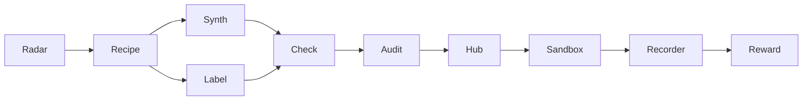

<div align="center">

# AgentSandbox

**Code Agent 执行沙箱 - 可复现的 Docker 隔离执行环境**
**Reproducible Docker sandbox for Code Agent task execution and trajectory replay**

[](https://pypi.org/project/knowlyr-sandbox/)
[](https://www.python.org/downloads/)
[](LICENSE)
[](#mcp-server)

[快速开始](#快速开始--quick-start) · [CLI 命令](#命令参考) · [MCP Server](#mcp-server--claude-integration) · [Knowlyr 生态](#data-pipeline-生态--ecosystem)

</div>

---

**GitHub Topics**: `sandbox`, `code-agent`, `docker`, `execution-environment`, `trajectory-replay`, `mcp`

为 Code Agent 提供标准化的 Docker 沙箱执行环境，支持代码任务的隔离执行、状态快照与轨迹重放。

## 核心能力 / Core Capabilities

```
TaskConfig (repo + commit) → Docker 沙箱 → Agent 工具调用 → 轨迹记录 → 可复现重放
```

### 标准工具接口 / Standard Tool Interface

| 工具 | 功能 | 说明 |
|------|------|------|
| `file_read` | 读取文件 | 支持行号范围 |
| `file_write` | 写入文件 | 自动创建目录 |
| `shell` | 执行命令 | 超时控制 |
| `search` | 搜索代码 | 正则匹配 |
| `git` | Git 操作 | diff, log, status |

### 解决的问题 / Problems Solved

| 痛点 | 传统方案 | AgentSandbox |
|------|----------|--------------|
| **隔离性** | 在宿主机执行，有安全风险 | Docker 容器隔离 |
| **可复现** | 环境差异导致结果不一致 | 固定镜像 + commit |
| **可追踪** | 操作过程难以记录 | 完整轨迹记录与重放 |
| **资源控制** | 无限制的资源使用 | CPU/内存/超时限制 |

## 安装 / Installation

```bash
pip install knowlyr-sandbox
```

可选依赖：

```bash
pip install knowlyr-sandbox[mcp]   # MCP 服务器
pip install knowlyr-sandbox[dev]   # 开发工具
pip install knowlyr-sandbox[all]   # 全部功能
```

## 快速开始 / Quick Start

### CLI 使用 / CLI Usage

```bash
# 创建沙箱
knowlyr-sandbox create --repo https://github.com/user/repo --commit abc123

# 在沙箱中执行工具
knowlyr-sandbox exec <sandbox_id> --tool shell --params '{"command": "python -m pytest"}'
```

<details>
<summary>输出示例</summary>

```
正在创建沙箱...
  仓库: https://github.com/user/repo
  Commit: abc123
  镜像: python:3.11-slim
✓ 沙箱创建成功: sandbox-a1b2c3
  工作目录: /workspace
  状态: running

执行工具: shell
  命令: python -m pytest
  Exit code: 0
  Output:
    ===== 42 passed, 3 failed =====
```

</details>

```bash
# 重置沙箱到初始状态
knowlyr-sandbox reset <sandbox_id>

# 重放执行轨迹
knowlyr-sandbox replay <sandbox_id> trajectory.json

# 列出活跃沙箱
knowlyr-sandbox list
```

<details>
<summary>输出示例</summary>

```
活跃沙箱列表:
  ID              状态      镜像                  创建时间
  sandbox-a1b2c3  running   python:3.11-slim     2025-01-15 10:30
  sandbox-d4e5f6  paused    node:18-slim         2025-01-15 11:45
总计: 2 个沙箱
```

</details>

---

## 轨迹重放 / Trajectory Replay

轨迹重放是 AgentSandbox 的核心能力之一，支持将 Agent 的执行过程完整回放：

```python
from agentsandbox.replay import replay_trajectory, Trajectory

# 从文件加载轨迹
trajectory = Trajectory.from_dict({
    "steps": [
        {"tool_name": "file_read", "params": {"path": "src/main.py"}},
        {"tool_name": "file_write", "params": {"path": "src/main.py", "content": "..."}},
        {"tool_name": "shell", "params": {"command": "pytest"}},
    ],
    "metadata": {"agent": "claude", "model": "claude-opus-4-20250514"}
})

# 重放
result = replay_trajectory(sandbox, trajectory)
print(f"成功: {result.success}")
print(f"偏离步骤: {result.divergence_step}")
```

### 沙箱快照 / Snapshot

```python
# 在任意时刻创建快照
snapshot_id = sandbox.snapshot()

# 重置到初始状态
sandbox.reset()
```

---

## MCP Server / Claude Integration

在 Claude Desktop / Claude Code 中直接使用。

### 配置 / Config

添加到 `~/Library/Application Support/Claude/claude_desktop_config.json`：

```json
{
  "mcpServers": {
    "knowlyr-sandbox": {
      "command": "uv",
      "args": ["--directory", "/path/to/agent-sandbox", "run", "python", "-m", "agentsandbox.mcp_server"]
    }
  }
}
```

### 可用工具 / Tools

| 工具 | 功能 |
|------|------|
| `create_sandbox` | 创建 Docker 沙箱执行环境 |
| `execute_tool` | 在沙箱中执行工具 (5 种标准工具) |
| `reset_sandbox` | 重置沙箱到初始状态 |
| `replay_trajectory` | 重放 Agent 执行轨迹 |

### 使用示例 / Usage Example

```
用户: 帮我在 https://github.com/user/repo 的 abc123 上创建沙箱并运行测试

Claude: [调用 create_sandbox]
        沙箱已创建: sandbox-xyz

        [调用 execute_tool: shell "pytest tests/"]
        测试结果:
        - 通过: 42
        - 失败: 3
        - 错误: 0
```

---

## Data Pipeline 生态 / Ecosystem

AgentSandbox 是 Knowlyr 生态的执行环境组件：

```mermaid
graph LR
    Radar["🔍 Radar<br/>情报发现"] --> Recipe["📋 Recipe<br/>逆向分析"]
    Recipe --> Synth["🔄 Synth<br/>数据合成"]
    Recipe --> Label["🏷️ Label<br/>数据标注"]
    Synth --> Check["✅ Check<br/>数据质检"]
    Label --> Check
    Check --> Audit["🔬 Audit<br/>模型审计"]
    Audit --> Hub["🎯 Hub<br/>编排层"]
    Hub --> Sandbox["📦 Sandbox<br/>执行沙箱"]
    Sandbox --> Recorder["📹 Recorder<br/>轨迹录制"]
    Recorder --> Reward["⭐ Reward<br/>过程打分"]
    style Sandbox fill:#0969da,color:#fff,stroke:#0969da
```



### 生态项目

| 层 | 项目 | 说明 | 仓库 |
|---|---|---|---|
| 情报 | **AI Dataset Radar** | 数据集竞争情报、趋势分析 | [GitHub](https://github.com/liuxiaotong/ai-dataset-radar) |
| 分析 | **DataRecipe** | 逆向分析、Schema 提取、成本估算 | [GitHub](https://github.com/liuxiaotong/data-recipe) |
| 生产 | **DataSynth** | LLM 批量合成、种子数据扩充 | [GitHub](https://github.com/liuxiaotong/data-synth) |
| 生产 | **DataLabel** | 轻量标注工具、多标注员合并 | [GitHub](https://github.com/liuxiaotong/data-label) |
| 质检 | **DataCheck** | 规则验证、重复检测、分布分析 | [GitHub](https://github.com/liuxiaotong/data-check) |
| 质检 | **ModelAudit** | 蒸馏检测、模型指纹、身份验证 | [GitHub](https://github.com/liuxiaotong/model-audit) |
| Agent | **AgentSandbox** | Docker 执行沙箱、轨迹重放 | You are here |
| Agent | **AgentRecorder** | 标准化轨迹录制、多框架适配 | [GitHub](https://github.com/liuxiaotong/agent-recorder) |
| Agent | **AgentReward** | 过程级 Reward、Rubric 多维评估 | [GitHub](https://github.com/liuxiaotong/agent-reward) |
| 编排 | **TrajectoryHub** | Pipeline 编排、数据集导出 | [GitHub](https://github.com/liuxiaotong/agent-trajectory-hub) |

### 端到端工作流 / End-to-end Flow

```bash
# 1. Radar: 发现高价值数据集
knowlyr-radar scan --topic "code-generation"

# 2. DataRecipe: 分析数据集，生成 Schema 和样例
knowlyr-datarecipe deep-analyze tencent/CL-bench -o ./output

# 3. DataSynth: 基于种子数据批量合成
knowlyr-datasynth generate ./output/tencent_CL-bench/ -n 1000

# 4. DataLabel: 生成标注界面，人工标注/校准
knowlyr-datalabel generate ./output/tencent_CL-bench/

# 5. DataCheck: 质量检查
knowlyr-datacheck validate ./output/tencent_CL-bench/

# 6. AgentSandbox: 在沙箱中执行 Code Agent 任务
knowlyr-sandbox create --repo https://github.com/user/repo --commit abc123

# 7. AgentRecorder: 录制 Agent 执行轨迹
knowlyr-recorder record <sandbox_id> -o trajectory.json

# 8. AgentReward: 对轨迹进行过程级打分
knowlyr-reward score trajectory.json --rubric rubric.yaml

# 9. TrajectoryHub: 编排完整流水线
knowlyr-hub run pipeline.yaml
```

### Agent 层 MCP 配置 / Agent Layer MCP Config

```json
{
  "mcpServers": {
    "knowlyr-sandbox": {
      "command": "uv",
      "args": ["--directory", "/path/to/agent-sandbox", "run", "python", "-m", "agentsandbox.mcp_server"]
    },
    "knowlyr-recorder": {
      "command": "uv",
      "args": ["--directory", "/path/to/agent-recorder", "run", "python", "-m", "agentrecorder.mcp_server"]
    },
    "knowlyr-reward": {
      "command": "uv",
      "args": ["--directory", "/path/to/agent-reward", "run", "python", "-m", "agentreward.mcp_server"]
    }
  }
}
```

---

## 命令参考

| 命令 | 功能 |
|------|------|
| `knowlyr-sandbox create` | 创建沙箱环境 |
| `knowlyr-sandbox exec <id>` | 在沙箱中执行工具 |
| `knowlyr-sandbox reset <id>` | 重置沙箱到初始状态 |
| `knowlyr-sandbox replay <id> <file>` | 重放 Agent 执行轨迹 |
| `knowlyr-sandbox list` | 列出活跃沙箱 |

### create 选项

| 选项 | 说明 | 默认值 |
|------|------|--------|
| `--repo` | Git 仓库 URL | (必填) |
| `--commit` | 起始 commit SHA | (必填) |
| `--language` | 编程语言 | python |
| `--image` | Docker 镜像 | python:3.11-slim |
| `--timeout` | 超时 (秒) | 300 |
| `--memory` | 内存限制 | 512m |
| `--cpu` | CPU 限制 | 1.0 |

---

## API 使用

```python
from agentsandbox import Sandbox, SandboxConfig
from agentsandbox.config import TaskConfig

# 配置
config = SandboxConfig(
    image="python:3.11-slim",
    timeout=300,
    memory_limit="512m",
)

task = TaskConfig(
    repo_url="https://github.com/user/repo",
    base_commit="abc123",
    test_command="pytest tests/",
)

# 创建沙箱
sandbox = Sandbox.create(config, task)

# 执行工具
result = sandbox.execute_tool("shell", {"command": "python -m pytest"})
print(f"Exit code: {result.exit_code}")
print(f"Output: {result.output}")

# 快照和重置
snapshot_id = sandbox.snapshot()
sandbox.reset()

# 清理
sandbox.close()
```

### SandboxConfig

| 属性 | 类型 | 默认值 | 说明 |
|------|------|--------|------|
| `image` | str | python:3.11-slim | Docker 镜像 |
| `timeout` | int | 300 | 超时 (秒) |
| `memory_limit` | str | 512m | 内存限制 |
| `cpu_limit` | float | 1.0 | CPU 限制 |
| `work_dir` | str | /workspace | 工作目录 |
| `network_enabled` | bool | False | 网络访问 |

### TaskConfig

| 属性 | 类型 | 默认值 | 说明 |
|------|------|--------|------|
| `repo_url` | str | "" | Git 仓库 URL |
| `base_commit` | str | "" | 起始 commit |
| `test_command` | str | "" | 测试命令 |
| `language` | str | python | 编程语言 |
| `setup_commands` | list | [] | 初始化命令 |

### ToolResult

| 属性 | 类型 | 说明 |
|------|------|------|
| `output` | str | 标准输出 |
| `exit_code` | int | 退出码 |
| `error` | str \| None | 错误信息 |
| `success` | bool | 是否成功 (属性) |

---

## 项目架构

```
src/agentsandbox/
├── config.py       # 沙箱和任务配置
├── sandbox.py      # 核心沙箱 (Docker 管理)
├── tools.py        # 标准工具接口 (5 种工具)
├── replay.py       # 轨迹重放
├── cli.py          # CLI 命令行
└── mcp_server.py   # MCP Server (4 工具)
```

---

## License

[MIT](LICENSE)

---

## AI Data Pipeline 生态

> 10 个工具覆盖 AI 数据工程全流程，均支持 CLI + MCP，可独立使用也可组合成流水线。

| 层 | 项目 | 说明 | 仓库 |
|---|---|---|---|
| 情报 | **AI Dataset Radar** | 数据集竞争情报、趋势分析 | [GitHub](https://github.com/liuxiaotong/ai-dataset-radar) |
| 分析 | **DataRecipe** | 逆向分析、Schema 提取、成本估算 | [GitHub](https://github.com/liuxiaotong/data-recipe) |
| 生产 | **DataSynth** | LLM 批量合成、种子数据扩充 | [GitHub](https://github.com/liuxiaotong/data-synth) |
| 生产 | **DataLabel** | 轻量标注工具、多标注员合并 | [GitHub](https://github.com/liuxiaotong/data-label) |
| 质检 | **DataCheck** | 规则验证、重复检测、分布分析 | [GitHub](https://github.com/liuxiaotong/data-check) |
| 质检 | **ModelAudit** | 蒸馏检测、模型指纹、身份验证 | [GitHub](https://github.com/liuxiaotong/model-audit) |
| Agent | **AgentSandbox** | Docker 执行沙箱、轨迹重放 | You are here |
| Agent | **AgentRecorder** | 标准化轨迹录制、多框架适配 | [GitHub](https://github.com/liuxiaotong/agent-recorder) |
| Agent | **AgentReward** | 过程级 Reward、Rubric 多维评估 | [GitHub](https://github.com/liuxiaotong/agent-reward) |
| 编排 | **TrajectoryHub** | Pipeline 编排、数据集导出 | [GitHub](https://github.com/liuxiaotong/agent-trajectory-hub) |



---

<div align="center">
<sub>为 Code Agent 提供安全、可复现的执行环境</sub>
</div>
